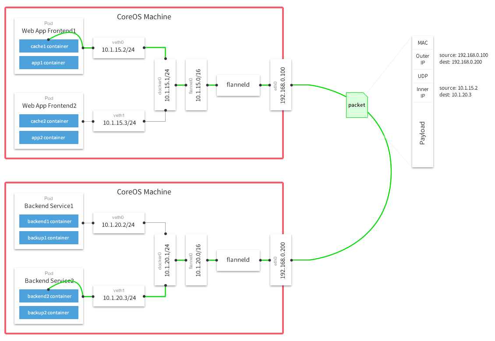

# 本机搭建三节点 k8s 集群

毕业设计题目是写一个基于微服务的高可用应用系统。微服务的部署使用 docker + k8s，所以前提是要有一个 k8s 集群。搭建过程中遇到了一些坑，把整个流程
记录下来一是回顾搭建过程，二是希望能尽可能的帮助后来的 k8s beginners 少走些弯路。

本文的侧重点在实际操作，k8s 组件基本概念相关的信息请参考 [k8s 官方文档](https://kubernetes.io/docs/concepts/) 或 [Kubernetes 指南 - by feiskyer](https://github.com/feiskyer/kubernetes-handbook)

如果对于本文有什么建议、意见及疑问，欢迎提 issue，或直接发邮件交流(邮箱很容易能找到，不再提供)。

---

<!-- TOC -->

- [环境依赖](#环境依赖)
- [搭建目标](#搭建目标)
- [k8s 个组件之间的关系](#k8s-个组件之间的关系)
- [k8s Pod 网络模型简介](#k8s-pod-网络模型简介)
- [配置流程](#配置流程)
    - [使用 virtualBox 创建三台虚拟机](#使用-virtualbox-创建三台虚拟机)
    - [安装 Docker](#安装-docker)
    - [安装 kube* 组件](#安装-kube-组件)
    - [搭建集群](#搭建集群)
        - [禁用交换区](#禁用交换区)
        - [初始化 master 节点](#初始化-master-节点)
        - [安装 flannel 网络](#安装-flannel-网络)
        - [添加节点到集群](#添加节点到集群)
- [最后](#最后)
- [参考](#参考)

<!-- /TOC -->

## 环境依赖

本文假设读者会使用 Linux 命令行。

k8s 的镜像源在墙外，所以需要读者掌握科学上网的技能。这个部分不属于本文的描述范围，我使用的方案是 Shadowsocks + Privoxy，有需要可以跟我交流。

```bash
- Docker    : 1.13.1
- kube*     : 1.10
- flannel   : 0.10.0
- virtualBox: 5.2.8
- OS        : ubuntu-16.04.4-server-amd64.iso
```

virtualBox 的版本不太重要，Docker 和 kube* 的版本最好使用 k8s 推荐的版本，否则可能会有问题，推荐的 Docker 版本可以在版本的 `release` 文档中查看。OS 的版本不同，后面的一些配置的方法会略有不同。

## 搭建目标

|主机名|主机 IP| flannel.1 |OS|集群角色|
|---|---|---|---|---|
|master|192.168.99.200|10.244.0.0|Ubuntu 16.04| master |
|node1|192.168.99.201|10.244.1.0|Ubuntu 16.04|node|
|node2|192.168.99.202|10.244.2.0|Ubuntu 16.04|node|

flannel.1 是 每台机器上的一个 VNI，通过 `ifconfig` 命令可以查看该接口的信息。

从任意一台机器 ping 另外两台机器 flanel.1 的 IP 能通就算集群搭建成功。

```bash
# from master
$ ping 10.244.1.0
PING 10.244.1.0 (10.244.1.0) 56(84) bytes of data.
64 bytes from 10.244.1.0: icmp_seq=1 ttl=64 time=0.659 ms
64 bytes from 10.244.1.0: icmp_seq=2 ttl=64 time=0.478 ms
64 bytes from 10.244.1.0: icmp_seq=3 ttl=64 time=0.613 ms
^C
--- 10.244.1.0 ping statistics ---
3 packets transmitted, 3 received, 0% packet loss, time 1999ms
rtt min/avg/max/mdev = 0.478/0.583/0.659/0.079 ms

$ ping 10.244.2.0
PING 10.244.2.0 (10.244.2.0) 56(84) bytes of data.
64 bytes from 10.244.2.0: icmp_seq=1 ttl=64 time=0.459 ms
64 bytes from 10.244.2.0: icmp_seq=2 ttl=64 time=0.504 ms
64 bytes from 10.244.2.0: icmp_seq=3 ttl=64 time=0.553 ms
^C
--- 10.244.2.0 ping statistics ---
3 packets transmitted, 3 received, 0% packet loss, time 2058ms
rtt min/avg/max/mdev = 0.459/0.505/0.553/0.042 ms
```

## k8s 个组件之间的关系


其实这个没必要多说，[Kubernetes Components](https://kubernetes.io/docs/concepts/overview/components/) 或 [Kubernetes 核心组件 - by feiskyer](https://kubernetes.feisky.xyz/zh/components/) 讲的已经非常好了，这里提到只是强调一下这部分的重要性。

## k8s Pod 网络模型简介



- 图片来源：[一次Flannel和Docker网络不通定位问题](http://www.cnblogs.com/ericnie/p/8028681.html)

为了省事，我直接引用了别人画的模型图。对于本次搭建的集群模型简单描述如下：

```bash

Pod1(10.244.1.10)   ----|
                        cni0(10.244.1.1/24) ----- flannel.1(10.244.1.0/32) ----- flanneld ----- enp0s8 (192.168.99.201)
Pod2(10.244.1.11)   ----|                                                                           |
                                                                                                    |
                                                                                                    |
                                                                                                    |
Pod3(10.244.2.10)   ----|                                                                           |
                        cni0(10.244.2.1/24) ----- flannel.1(10.244.2.0/32) ----- flanneld ----- enp0s8 (192.168.99.202)
Pod4(10.244.2.11)   ----|

```

1. `cni0` 和 `flannel.1` 都是 VNI，由 flannel 组件创建，集群搭建完成后可以通过 `ifconfig` 进行查看。
1. flannel 组件 在每台机器上运行了一个 `flanneld`，它是用来转发流量，解决主机间通信的问题。
1. `enp0s8` 是 virtualBox 的 Host-Only 适配器。

## 配置流程

### 使用 virtualBox 创建三台虚拟机

virtualBox 安装比较简单，不再介绍，GUI 工具用起来也很方便，这部分只介绍我认为需要提示的部分。

1. 内存推荐 2048M, CPU 推荐 2个
1. 默认只有一个 NAT 适配器，添加一个 Host-Only Adapter。NAT 适配器是虚拟机用来访问互联网的，Host-Only 适配器是用来虚拟机之间通信的。
1. 以 Normal Start 方式启动虚拟机安装完系统以后，因为是 server 版镜像，所以没有图形界面，直接使用用户名密码登录即可。
1. 修改配置，`enp0s8` 使用静态 IP。配置请参考 [SSH between Mac OS X host and Virtual Box guest](https://gist.github.com/c-rainstorm/1bbd44b388acd35ca6eaf07d1fbd9bc7)。注意配置时将其中的网络接口名改成你自己的 Host-Only Adapter 对应的接口。
1. 一台虚拟机创建完成以后可以使用 clone 方法复制出两台节点出来，注意 clone 时为新机器的网卡重新初始化 MAC 地址。
1. 三台虚拟机的静态 IP 都配置好以后就可以使用 ssh 在本地主机的终端上操作三台虚机了。虚机使用 Headless Start 模式启动

### 安装 Docker

- **三台都装**

当前 Ubuntu 的 docker 版本刚好合适，所以可以直接安装，但是有必要提前查看一下 docker 版本，以免装错。

```bash
# apt search docker.io
apt-get update
apt-get install -y docker.io
systemctl enable docker
systemctl start docker
```

[official Docker installation guides](https://docs.docker.com/engine/installation/)

- docker 配置代理。镜像源在墙外，docker pull image 需要代理

```bash
mkdir -p /etc/systemd/system/docker.service.d

cat <<EOF >/etc/systemd/system/docker.service.d/http-proxy.conf
[Service]
Environment="HTTP_PROXY=https://192.168.99.1:8118/"
Environment="HTTPS_PROXY=https://192.168.99.1:8118/"
Environment="NO_PROXY=localhost,127.0.0.1,localaddress,.localdomain.com"
EOF

systemctl daemon-reload
systemctl restart docker
```

- 测试配置

```bash
docker info | grep Proxy  # 有输出说明配置成功

docker pull gcr.io/google-containers/busybox:1.27 # pull 成功代表工作正常。
```

- [Google 镜像库](https://console.cloud.google.com/gcr/images/google-containers/GLOBAL?project=google-containers)

### 安装 kube* 组件

- **三台都装**

```bash
apt-get update && apt-get install -y apt-transport-https
curl -s https://packages.cloud.google.com/apt/doc/apt-key.gpg | apt-key add -
cat <<EOF >/etc/apt/sources.list.d/kubernetes.list
deb http://apt.kubernetes.io/ kubernetes-xenial main
EOF
apt-get update
apt-get install -y kubelet kubeadm kubectl
systemctl enable kubelet
systemctl start kubelet
```

- Master 节点配置 cgroup driver

```bash
docker info | grep -i cgroup  # 一般是 cgroupfs
cat /etc/systemd/system/kubelet.service.d/10-kubeadm.conf  # --cgroup-driver 对应值默认是 systemd

#两个值不一致的话使用以下命令修改
sed -i "s/cgroup-driver=systemd/cgroup-driver=cgroupfs/g" /etc/systemd/system/kubelet.service.d/10-kubeadm.conf

#重启 kubelet
systemctl daemon-reload
systemctl restart kubelet
```

- curl 访问的是墙外的网站，无法访问的话可以配置系统代理。

`http://192.168.99.1:8118/` 是我本地使用的 HTTP 代理，Privoxy 监听 8118 端口，按照实际情况修改该地址。

```bash
# 全局代理，不推荐
cat <<EOF >>/etc/environment
http_proxy="http://192.168.99.1:8118/"
https_proxy="http://192.168.99.1:8118/"
no_proxy="master, node1, node2, 192.168.99.1"
EOF
source /etc/environment

#当前 shell,推荐
export http_proxy="http://192.168.99.1:8118/"
export https_proxy="http://192.168.99.1:8118/"
export no_proxy="master, node1, node2, 192.168.99.1"
```

- `apt` 使用代理

```bash
cat <<EOF >>/etc/apt/apt.conf
Acquire::http::Proxy "http://192.168.99.1:8118/";
Acquire::https::Proxy "https://192.168.99.1:8118/";
EOF
```

### 搭建集群

#### 禁用交换区

k8s 文档明确要求的。

- **三台都禁用**

```bash
swapoff -a
```

#### 初始化 master 节点

- **初始化过程会访问墙外网站，如果 init 不能顺利执行，请配置全局代理**

```bash
kubeadm init --apiserver-advertise-address=192.168.99.200 --pod-network-cidr=10.244.0.0/16
```

1. `--apiserver-advertise-address=192.168.99.200` 绑定 apiserver 到 master 节点的 Host-Only 适配器的地址，默认是绑到 NAT 的地址上，这样其他机器是永远也访问不到的。
1. `--pod-network-cidr=10.244.0.0/16` 指定 pod 网络地址空间，我们使用 flannel 组件必须使用这个空间。
1. kubeadm 的完整参考手册 [kubeadm reference guide](https://kubernetes.io/docs/reference/setup-tools/kubeadm/kubeadm/)
1. 推荐保存最后输出的 join 命令到文件(以免忘记或找不到了)，方便添加节点到集群。如果忘了也找不到输出了，网上有方法生成哈希值，请自行查找。

- 配置 kubectl 访问集群

```bash
# root user
export KUBECONFIG=/etc/kubernetes/admin.conf

# non-root user
mkdir -p $HOME/.kube
sudo cp -i /etc/kubernetes/admin.conf $HOME/.kube/config
sudo chown $(id -u):$(id -g) $HOME/.kube/config

# 从本地主机操作，需要在本地安装 kubectl 客户端
mkdir -p ~/.kube

scp <username>@192.168.99.200:/home/<username>/.kube/config ~/.kube/config # 从 master 复制配置文件到本地
```

- 测试配置

```bash
kubectl cluster-info #有正常输出即可
```

#### 安装 flannel 网络

- flannel 默认的监听接口是 NAT 适配器的接口，我们需要的是 Host-Only 适配器的接口，所以需要修改 kube-flannel.yml 文件

```bash
wget https://raw.githubusercontent.com/coreos/flannel/master/Documentation/kube-flannel.yml

给 /opt/bin/flanneld 命令添加 --iface="enp0s8" 参数 # enp0s8 是 Host-Only 适配器对应的接口

kubectl apply -f kube-flannel.yml
```

- 测试配置

```bash
kubectl get pods --all-namespaces -o wide # 稍等一会，下载镜像需要一定时间，最后应该显示 flannel pods 是 Running 状态， kube-dns 也是 Running 状态
```

- 消除 master 隔离。默认 master 上不调度 pods，要允许另外的 pods 在 master 上运行请执行该命令

```bash
kubectl taint nodes --all node-role.kubernetes.io/master-
```

#### 添加节点到集群

- 在节点上执行 `kubeadm init` 最后输出的 join 命令

```bash
kubeadm join --token <token> <master-ip>:<master-port> --discovery-token-ca-cert-hash sha256:<hash>
```

## 最后

feiskyer 为该搭建过程写了[自动化脚本](https://github.com/feiskyer/ops)，有兴趣可以尝试一下。

## 参考

1. [k8s 官方文档](https://kubernetes.io/docs/concepts/)
1. [Kubernetes 指南 - by feiskyer](https://github.com/feiskyer/kubernetes-handbook)
1. [一次Flannel和Docker网络不通定位问题](http://www.cnblogs.com/ericnie/p/8028681.html)
1. [coreos/flannel - README](https://github.com/coreos/flannel/blob/master/README.md)
1. [Installing kubeadm](https://kubernetes.io/docs/setup/independent/install-kubeadm/)
1. [Docker Ubuntu Behind Proxy](https://stackoverflow.com/questions/26550360/docker-ubuntu-behind-proxy?utm_medium=organic&utm_source=google_rich_qa&utm_campaign=google_rich_qa)
1. [Using kubeadm to Create a Cluster](https://kubernetes.io/docs/setup/independent/create-cluster-kubeadm/)
