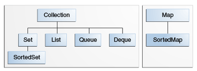

# 面试相关知识总结

## 自我介绍

您好，我叫张宝琛， 19 岁。是郑州大学 2014 级软件工程专业的一名学生。

我的个人特点主要有三个
第一点，行动力很强，做事不拖沓。关于这一点我觉得举一个个人经历来说明更合适。就是在我高考完（14 年 6 月份）和长辈们聊天的时候提到了黄河。我长这么大还没有去看过黄河呢！所以当时就特别想去看一看。然后当天晚上就制定了路线，第二天一早，骑上自行车就出发了。
第二点，上进心强，抗压能力强。这个我觉得每个想要进阿里的同学上进心都很强，所以我觉的没有必要再多说什么了。
第三点，努力透过本质看问题。学习新东西的时候我会多问几个为什么，想要更多的了解更深一层次的东西。平时跟同学一块学习新技术的时候他们遇到问题一般都会来问我，通常情况下我看到问题稍微一分析就能看出问题出在哪里。其实说实话，我并不觉得我比别人聪明很多，我能看出问题根源在哪，就是因为我在学习技术的时候多问了几个为什么，理解的相对来说更加深入一点而已。
前两点我觉得是先天的，跟个人性格有关。而第三点是后天培养的，我正在努力。

目前的兴趣在操作系统和计算机网络，目前正在学习相关的概念、系统编程和网络编程。

未来 5 年的规划是走技术路线，专心做技术，目前没有打算转管理岗。


## Java 基础篇

###  Java 集合框架

集合框架是用来呈现和操作集合的一个统一体系结构。主要包含三个部分：接口、实现和算法。

1. 接口：对集合操作的抽象数据类型，不依赖与底层数据结构的具体实现，通过接口可以多态调用不同实现类的方法。
1. 实现：是接口的具体的实现类，是可重用的数据结构
1. 算法：实现接口时通常会提供一些算法相关的功能，例如排序和查找。相同的函数不同数据结构通常会有不同的算法实现

#### 接口

接口是 Java 集合框架的核心



1. `Collection` 是 Java 集合框架继承树的根节点，为集合提供最一般的操作。Java 集合框架为其实现了一些子接口，但并未为其提供具体的直接实现类
    - 遍历集合的方法
        1. JDK 8 以后，聚合操作 + Lambda 表达式。例子：
            ```java
            myShapesCollection.stream()
            .filter(e -> e.getColor() == Color.RED)
            .forEach(e -> System.out.println(e.getName()));
            ```
        1. forEach 循环(语法糖，编译器会做翻译--翻译为迭代器或普通的 for 循环)
            ```java
            for (Object o : collection)
                System.out.println(o);
            ```
        1. 迭代器
            ```java
            static void filter(Collection<?> c) {
                for (Iterator<?> it = c.iterator(); it.hasNext(); )
                    if (!cond(it.next()))
                        it.remove();
            }
            ```
        - 在遍历的过程中需要删除当前元素时使用迭代器
        - 需要对多个集合同事遍历时使用迭代器
    - 批量操作
    - Array 操作
        - `toArray` 方法讲集合框架转为旧的 API 即类似 Object[] 形式
    - 所有的 `Collection` 实现类都需要提供一个具有单一参数 `Collection` 的构造函数，用于将集合在不同数据结构之间的转换
1. `Set` 接口无法包含重复元素，是数学上抽象集合的 Java 实现。当两个集合实例中包含相同元素时就说这两个 `Set` 是等价的。
    1. 去重
    1. 批量操作与数学上的相关概念相同
        - `containsAll` 子集关系
        - `addAll` 并集
        - `retainAll` 交集
        - `removeAll` 差集
1. `List` 接口可以包含重复元素
    - 提供位置访问
    - 搜索
    - 迭代
    - 范围视图
1. `Map` 无法包含重复的 `key`，一个 `key` 对应一个 `value`

#### 实现类

1. 根据实现类的用途可以将实现类分为以下几种：
    1. 通用实现。我们经常使用的的实现类，下面要介绍的主要属于该类
    1. 专用实现。为特殊目的而设计实现，为满足该目的通常包含一些非标准的特性和使用限制。
    1. 并发实现。为了支持高并发而实现， 在 `java.util.concurrent` 中可以找到这些实现类
    1. 包装器实现。通常为已有的实现类做一些封装，添加一些功能。例如可以在通用实现的基础上提供同步功能等。
    1. 便捷实现。轻量级的通用实现。通过静态工厂方法实现。
    1. 抽象实现。用于自定义实现类，但基本不用。
1. 通用目的的实现都允许 null 元素，keys， values。
1. 通用目的的实现都不是线程安全的。旧的集合 `Vector`、`Hashtable` 是同步的。去掉的原因是集合通常实在单线程、只读模式或实例对象本身能够提供同步，所以实现同步并不会带来益处，而且不必要的同步有时会引发死锁等问题。需要线程安全的话可以使用 Wrapper（讲任意的集合转为同步集合）
1. 通用目的的实现都有 fail-fast 迭代器（遍历时当检测到不合法的并发修改会迅速终止迭代过程）
1. 通用目的的实现都是 `Serializable` 的（可用于对象的持久化、网络传输等。可通过反序列化恢复对象）


1. Set
    1. `HashSet`
        1. 使用 哈希表作为底层的数据结构，是性能最优的实现类，但是无法保证遍历的顺序（遍历的顺序可能与插入的顺序不一致）
        1. 查找元素消耗常量时间
        1. 初始容量默认为 16
        1. 迭代器迭代的时间与容量成正比(因为哈希表数据结构的特点，有可能最后一个部位也有数据，迭代器需要从头遍历到尾)
        1. 底层实现为 `HashMap`，keys 为 Set 中元素集合, values 为由 `HashSet` 生成的一个 `Object`，即所有的 value 都是相同的。
    1. `TreeSet`
        1. 使用红黑树作为底层数据结构，根据元素的值进行排序。效率上大不如 `HashSet`。
        1. 查找元素消耗时间为 log（n）
        1. 底层为 `TreeMap`，keys 为 Set 中元素集合, values 为由 `TreeMap` 生成的一个 `Object`，即所有的 value 都是相同的。
    1. `LinkedHashSet`
        1. 为 `HashSet` 的子类
        1. 在 `HashSet` 的基础上增加了双向链表结构用于确定元素的插入顺序（遍历的顺序与插入顺序一致）。因为需要维护双向链表，所以效率上较 `HashSet` 稍差。
    1. `EnumSet`
        1. 底层为位向量，使用 `long` 类型保存，在其上的操作均为位操作。
1. List
    1. `ArrayList`
        1. 数组实现
        1. 使用不带参数的构造器默认初始化为一个空数组，当添加一个新元素时自动扩容为默认容量 10，
        1. 增长策略： `int newCapacity = oldCapacity + (oldCapacity >> 1);`
        1. `subList` 和 `ArrayList` 共用底层的数据结构，如果得到子集后对原 `ArrayList` 进行修改，则子集的遍历结果是不可知的。
    1. `LinkedList`
        1. 双向链表
        1. 内部类 `Node` 作为节点，`item`、`prev`、`next`
1. Map
    1. `HashMap`
        1. 哈希表实现
        1. 初始容量为 16.
    1. `TreeMap`
    1. `LinkedHashMap`

1. `voliate` 关键字(并发相关，后期补充)
    1. 保证共享变量直接写会主存
    1. 保证所有共享变量的修改对所有线程可见
1. JDK 1.8 的改进


## 参考

1. [The Java™ Tutorials - Trail: Collections](http://docs.oracle.com/javase/tutorial/collections/index.html)
1. [聊聊并发（一）——深入分析Volatile的实现原理](http://www.infoq.com/cn/articles/ftf-java-volatile)
1. [Java Volatile Keyword](http://tutorials.jenkov.com/java-concurrency/volatile.html)
1. [What's New in JDK 8](http://www.oracle.com/technetwork/java/javase/8-whats-new-2157071.html)
