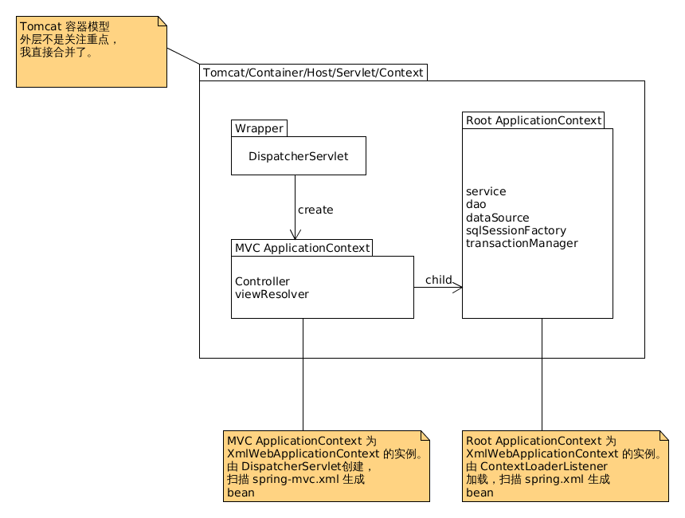
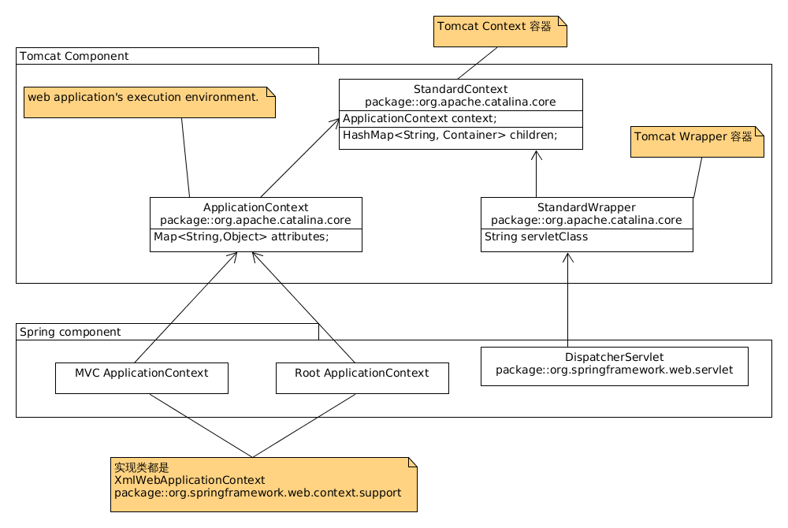

# Maven + Spring + SpringMVC + Mybatis 整合

通过这篇文章你可以获取的内容：
1. 整个配置流程。
1. 对于每一个配置项，Spring 到底帮我们做了什么？

本文假设读者：

1. 未使用 IDEA 进行过 Web 项目开发
1. 未使用过 Maven 进行项目构建
1. 已学习过 Spring、SpringMVC、Mybatis

环境搭建：

- IDE： `IntelliJ IDEA 2017.1.1（Ultimate)`
- Web Server: `Tomcat 8.0.43`
- Spring: `4.3.7.RELEASE`
- Mybatis: `3.4.4`

如果需要示例代码，可以参考 [SSM-Demo](https://github.com/c-rainstorm/ssm-Demo).

---

<!-- TOC -->

- [Maven + Spring + SpringMVC + Mybatis 整合](#maven--spring--springmvc--mybatis-整合)
    - [Spring && SpringMVC](#spring--springmvc)
        - [工程搭建](#工程搭建)
            - [新建 Web Application](#新建-web-application)
            - [添加 Maven 支持](#添加-maven-支持)
            - [工程目录简介](#工程目录简介)
        - [代码实现](#代码实现)
            - [View 层](#view-层)
            - [Controller](#controller)
            - [Service](#service)
        - [配置文件编写](#配置文件编写)
            - [`Spring.xml`](#springxml)
            - [`Spring-mvc.xml`](#spring-mvcxml)
            - [`web.xml`](#webxml)
        - [运行测试](#运行测试)
    - [Spring && SpringMVC && Mybatis](#spring--springmvc--mybatis)
        - [代码实现](#代码实现-1)
            - [Dao](#dao)
            - [service](#service)
        - [配置文件编写](#配置文件编写-1)
            - [`UserDao.xml`](#userdaoxml)
            - [`Spring.xml`](#springxml-1)
            - [pom.xml](#pomxml)
        - [运行测试](#运行测试-1)
    - [参考](#参考)

<!-- /TOC -->

---

## Spring && SpringMVC

### 工程搭建

#### 新建 Web Application

1. File -> new -> project..
1. Java -> Web Application
    - 

#### 添加 Maven 支持

1. 右键工程名，点击 Add Framwork Support..
    - 
1. 配置编译器源版本及目标字节码版本
    - 在 `pom.xml` 配置文件中添加以下配置。
    - **Tips：不添加的话目标字节码版本默认使用 `JDK1.5`**
    ```xml
    <properties>
        <maven.compiler.source>1.8</maven.compiler.source>
        <maven.compiler.target>1.8</maven.compiler.target>
    </properties>
    ```

#### 工程目录简介

```
.
|-- pom.xml                    // Maven 配置文件
|-- src
|   |-- main
|   |   |-- java               // Java 代码存放位置
|   |   `-- resources          // 配置文件存放位置
|   `-- test
|       `-- java               // 测试类存放位置
`-- web                        // 存放 View 层用到的文件，会直接部署到服务器
    |-- index.jsp
    `-- WEB-INF
        `-- web.xml            // Web 应用程序的 Web 组件的配置和部署信息
```


### 代码实现

我们以一个最简单的用户登陆操作来说明配置的过程。

#### View 层

1. form 表单
    ```html
    <!-- 1. 对应控制层 URL 为 /user/checkLogin -->
    <!-- 2. input 标签中的 class 属性在 JS 中进行元素定位需要用到 -->
    <!-- 3. input 标签中的 name 属性在控制层中提取表单数据时需要用到，即必须与控制层中对应方法的参数名或参数实体类中的域的名称一致，否则获取不到数据 -->
    <form action="${pageContext.request.contextPath}/user/checkLogin" method="post">
        username: <input type="text" class="username" name="username" placeholder="username..."><br>
        password: <input type="password" class="password" name="password" placeholder="password..."><br>
        <input type="submit" value="submit">
    </form>
    ```
1. 使用 JS 在传输之前进行加密
    ```js
    $(document).ready(function () {
        // 以为网络传输时使用明文，所以直接将密码提交到后台的方式很不安全，所以在传输之前就进行加密。
        // 在这里加密方法用的是 MD5 。你也可以选择其他的加密方式，加密用的 JS 库应该很容易着，
        // 这里我用的是 [JavaScript-MD5](https://github.com/blueimp/JavaScript-MD5)。
        $("form").on("submit", function () {
            var pass = $(".password");
            pass.val(md5(pass.val()));
        })
    })
    ```

#### Controller

1. 因为 Controller 需要用到 Spring 的注解，所以需要先添加 Maven 依赖，即将下面的配置写入 pom.xml 中，并 Import Change。
    ```xml
    <properties>
        <org.springframework.version>4.3.7.RELEASE</org.springframework.version>
    </properties>

    <dependency>

    <dependencies>
        <dependency>
            <groupId>org.springframework</groupId>
            <artifactId>spring-core</artifactId>
            <version>${org.springframework.version}</version>
        </dependency>
        <dependency>
            <groupId>org.springframework</groupId>
            <artifactId>spring-beans</artifactId>
            <version>${org.springframework.version}</version>
        </dependency>
        <dependency>
            <groupId>org.springframework</groupId>
            <artifactId>spring-orm</artifactId>
            <version>${org.springframework.version}</version>
        </dependency>
        <dependency>
            <groupId>org.springframework</groupId>
            <artifactId>spring-context</artifactId>
            <version>${org.springframework.version}</version>
        </dependency>
        <dependency>
            <groupId>org.springframework</groupId>
            <artifactId>spring-web</artifactId>
            <version>${org.springframework.version}</version>
        </dependency>
        <dependency>
            <groupId>org.springframework</groupId>
            <artifactId>spring-webmvc</artifactId>
            <version>${org.springframework.version}</version>
        </dependency>
        <dependency>
            <groupId>org.springframework</groupId>
            <artifactId>spring-aop</artifactId>
            <version>${org.springframework.version}</version>
        </dependency>
        <dependency>
            <groupId>org.apache.logging.log4j</groupId>
            <artifactId>log4j-api</artifactId>
            <version>2.8.2</version>
        </dependency>
        <dependency>
            <groupId>org.apache.logging.log4j</groupId>
            <artifactId>log4j-core</artifactId>
            <version>2.8.2</version>
        </dependency>
    </dependencies>
    ```
1. Controller
    ```java
    package com.github.crainstorm.oss.user.action;

    @Controller
    @RequestMapping("/user")
    public class UserAction {

        private static Logger logger = LogManager.getLogger(UserAction.class);
        @Autowired
        private UserService service;

        @RequestMapping("/checkLogin")
        public String checkLogin(User user) {
            logger.trace("enter checkLogin...");
            if (logger.isDebugEnabled()) {
                logger.debug(user);
            }
            if (service.loginSuccess(user)) {
                logger.info("login success...");
                return "redirect:/index.jsp";
            } else {
                logger.info("login failed...");
                return "login/user";
            }
        }
    }
    ```
1. 用到了 `log4j2`, 简单配置一下

    ```xml
    <?xml version="1.0" encoding="UTF-8"?>

    <Configuration status="WARN">
        <Appenders>
            <Console name="Console" target="SYSTEM_OUT">
                <PatternLayout pattern="%d [%t] %-5level %logger{36} - %msg%n"/>
            </Console>
        </Appenders>
        <Loggers>
            <!-- 类寻找 Logger 时会根据包名一层一层向上找，如果没有找到，则默认使用 Root -->
            <Root level="trace">
                <AppenderRef ref="Console"/>
            </Root>
        </Loggers>
    </Configuration>
    ```

#### Service


```java
package com.github.crainstorm.oss.user.service;

public interface UserService {
    boolean loginSuccess(User user);
}
```

```java
package com.github.crainstorm.oss.user.service;

@Service
public class UserServiceImpl implements UserService {
    private static final Logger LOGGER = LogManager.getLogger(UserServiceImpl.class);

    // 因为先配置 Spring + SpringMVC， 所以 dao 层先不管
    public boolean loginSuccess(User user) {
        return true;
    }
}
```

### 配置文件编写

配置文件编写前我们需要简单了解一下整个请求流程：
- 

#### `Spring.xml`

```xml
    <!-- context:annotation-config 配置可以使 Spring 帮我们加载几个常用的 BeanPostProcessor -->
    <!-- 1. AutowiredAnnotationBeanPostProcessor： 用于处理 @Autowired -->
    <!-- 2. CommonAnnotationBeanPostProcessor： 用于处理 @PostConstruct、@PreDestory、@Resource -->
    <!-- 3. PersistenceAnnotationBeanPostProcessor： 用于处理 @PersistenceUnit、@ PersistenceContext -->
    <!-- 4. RequiredAnnotationBeanPostProcessor： 用于处理 @Required -->

    <!--<context:annotation-config></context:annotation-config>-->

    <!-- 1. context:component-scan 隐含实现了 context:annotation-config 的功能， 所以使用了 context:component-scan 就不需要 context:annotation-config 了 -->
    <context:component-scan base-package="com.github.crainstorm.oss">

        <!-- 不扫描控制层组件，控制层组件的扫描放到 SpringMVC 配置文件中进行 -->
        <context:exclude-filter type="annotation"
                                    expression="org.springframework.stereotype.Controller"/>
        <context:exclude-filter type="annotation"
                                    expression="org.springframework.web.bind.annotation.ControllerAdvice"/>
    </context:component-scan>
```


#### `Spring-mvc.xml`

```xml

    <!-- 该注解帮我们注册了 DefaultServletHttpRequestHandler，用来处理静态资源。-->
    <!-- 我们一般配置 DispatcherServlet 的 url-pattern 为 '/' -->
    <!-- 这种方法只能映射到我们编写的 Controller，如果直接请求 JSP 文件的话会直接返回 404 -->
    <!-- 加上该注解后，JSP 这种静态文件可以交给 DefaultServletHttpRequestHandler 来处理，就可以正常返回了-->
    <mvc:default-servlet-handler></mvc:default-servlet-handler>

    <!-- mvc:annotation-driven 配置使 Spring 加载了多个类，这里只举出几个： -->
    <!-- 1. @RequestMapping： RequestMappingHandlerMapping(用来注册 Mapping)、RequestMappingHandlerAdapter(根据 Mapping 调用相应的 Controller) -->
    <!-- 2. @ExceptionHandler： ExceptionHandlerExceptionResolver -->
    <!-- 2. HttpMessageConverter: 转换器，用来提取 Request 中的参数(@RequestBody)，和将返回值转换成相应的格式(JSON 等)写入 Response 中(@ResponseBody)-->
    <mvc:annotation-driven></mvc:annotation-driven>

    <!-- 组件扫描，只扫描 Controller-->
    <context:component-scan base-package="com.github.crainstorm.oss">
       <context:include-filter type="annotation"
                                    expression="org.springframework.stereotype.Controller"></context:include-filter>
       <context:include-filter type="annotation"
                                    expression="org.springframework.web.bind.annotation.ControllerAdvice"></context:include-filter>
    </context:component-scan>


    <!-- 注册 ViewResolver, mvc:annotation-driven 其实已经注册过一个默认的了，该定义会覆盖原来的定义 -->
    <bean id="viewResolver" class="org.springframework.web.servlet.view.InternalResourceViewResolver">
        <property name="prefix" value="/views/"/>
        <property name="suffix" value=".jsp"/>
    </bean>
```

#### `web.xml`

```xml

        <!--
            作用：基于 "contextClass" and "contextConfigLocation" servlet context-params 初始化 root application context

            ContextLoaderListener 是 ContextLoader 的子类，实际的初始化工作由 ContextLoader 来做。
            1. ContextLoader 先在 web.xml 查找一个叫 contextClass 的 context-params, 如果找到了就创建一个该类型的 ApplicationContext，如果找不到就创建一个 XmlWebApplicationContext。我们通常都没有配置该参数，所以用的都是默认的这种.
            2. 从 web.xml 中查找一个叫 contextConfigLocation 的 context-param。如果找到了就将该值传递给之前创建的 XmlWebApplicationContext 实例，如果没有找到，就使用 XmlWebApplicationContext 默认的路径 `/WEB-INF/applicationContext.xml`
            3. 解析 contextConfigLocation 配置文件，加载 BeanBefinition
        -->
        <listener>
            <listener-class>org.springframework.web.context.ContextLoaderListener</listener-class>
        </listener>

        <!-- 指定配置文件位置 -->
        <context-param>
            <param-name>contextConfigLocation</param-name>
            <param-value>classpath:spring.xml</param-value>
        </context-param>

        <!-- 字符编码过滤器 -->
        <filter>
            <filter-name>CharacterEncodingFilter</filter-name>
            <filter-class>org.springframework.web.filter.CharacterEncodingFilter</filter-class>
            <init-param>
                <param-name>encoding</param-name>
                <param-value>UTF-8</param-value>
            </init-param>
        </filter>

        <filter-mapping>
            <filter-name>CharacterEncodingFilter</filter-name>
            <url-pattern>/</url-pattern>
        </filter-mapping>

        <!-- 注册 DispatcherServlet -->
        <servlet>
            <servlet-name>DispatcherServlet</servlet-name>
            <servlet-class>org.springframework.web.servlet.DispatcherServlet</servlet-class>

            <!-- 初始化该 Servlet 时会创建一个 XmlWebApplicationContext, 该参数指定了对应的配置文件所在位置 -->
            <init-param>
                <param-name>contextConfigLocation</param-name>
                <param-value>classpath:spring-mvc.xml</param-value>
            </init-param>

            <!-- 启动时加载，小于 0 则忽略该配置 -->
            <load-on-startup>1</load-on-startup>
        </servlet>

        <!-- 该 Servlet 拦截所有请求 -->
        <servlet-mapping>
            <servlet-name>DispatcherServlet</servlet-name>
            <url-pattern>/</url-pattern>
        </servlet-mapping>
```

- Tomcat 运行时逻辑模型：
    - 
    1. Tomcat 容器中一个 Context 为一个工程，一个 wrapper 封装一个 Servlet。注意这里的 Context 跟 Spring 中的 ApplicationContext 没有关系，它代表的是一个容器，实现类是 `org.apache.catalina.core.StandardContext`
    1. Tomcat 容器中的 Context 与 Spring 中的 ApplicationContext 的关系如下图(不是类图)：
        - 

### 运行测试

1. 因为 IDEA 不会自动帮我们部署 Maven 库，所以我们需要将这些库添加到 /WEB-INF/lib/ 下：
    1. 右键工程，点击 Open Module Settings，点击左侧的 Artifacts
    1. 我们可以看到的是 Output Layout，左侧是 WEB-INF，右侧是添加的 Maven 依赖，全选右侧 Maven，右键并点击 put into /WEB-INF/lib
    1. 这样在启动服务器时依赖库就可以自动部署到服务器了，需要注意的是**每增加一些 Maven 依赖，在启动服务器前都需要将这些依赖添加到 /WEB-INF/lib**
1. 配置 Tomcat 服务器
    1. File -> settings -> Build,Execution,Deployment -> Application Servers ,添加一个 Tomcat 服务器
    1. Run -> Edit Configurations 添加一个 Tomcat Server(Local)
    1. Application server 选择刚配置的 Tomcat 服务器
    1. Deployment 添加 Artifacts，右侧的 Application context 指的是如何访问该工程，比如 如果填了 `/oss`， 那么可以通过 `http://localhost:8080/oss` 来访问首页，如果这个地方做了修改 Server 下的默认连接也需要作相应修改，否则是无法访问的。
    1. 也可以修改一下配置的命名，默认是 Unnamed。
1. 使用 log4j2 来输出 Spring 的日志，这样万一出了什么问题的话就能很快的定位问题位置
    1. 配置 Logger
        ```xml
        <logger name="org.springframework" level="debug" additivity="false">
            <AppenderRef ref="Console"/>
        </logger>
        ```
    1. 导入适配器依赖
        ```xml
        <dependency>
            <groupId>org.apache.logging.log4j</groupId>
            <artifactId>log4j-jcl</artifactId>
            <version>2.1</version>
        </dependency>
        ```
1. 测试结果
```log
2017-04-23 10:23:09,422 [http-nio-8080-exec-11] TRACE com.github.crainstorm.oss.user.action.UserAction - enter checkLogin...
2017-04-23 10:23:09,422 [http-nio-8080-exec-11] DEBUG com.github.crainstorm.oss.user.action.UserAction - User{username='17839918876', password='f217305153bc4761daaf98b3e5bb41c7', nickname='17839918876', phone='null', birthday=null}
2017-04-23 10:23:09,422 [http-nio-8080-exec-11] INFO  com.github.crainstorm.oss.user.action.UserAction - login success...
```

## Spring && SpringMVC && Mybatis

### 代码实现

#### Dao

```sql
create table user
(
   user_id              int not null AUTO_INCREMENT,
   username             varchar(25) not null unique,
   password             varchar(120) not null,
   nickname             varchar(20),
   phone                char(11) unique not null,
   avatar               varchar(50) default '/images/avatars/default.jpg',
   sex                  varchar(8) default '保密',
   birthday             date,
   is_valid             bool not null default true,
   primary key (user_id),
   index (username),
   check(sex in('男','女','保密'))
);
```

```java
package com.github.crainstorm.oss.user.dao;

/**
 * Created by chen on 4/17/17.
 */

@Repository
public interface UserDao {
    int checkLogin(User user);
}
```

#### service
```java
@Transactional                               // 事务
@EnableTransactionManagement                 // 重要！重要！重要！ 如果不加的话，部署到服务器上以后事务无法生效，即 JDBC 无法被 Spring 的事务管理器管理，执行过程中出现问题无法回滚
@Service
public class UserServiceImpl implements UserService {
    private static final Logger LOGGER = LogManager.getLogger(UserServiceImpl.class);

    @Autowired
    private UserDao dao;

    @Transactional(readOnly = true)
    public boolean loginSuccess(User user) {
        int num = dao.checkLogin(user);
        if (LOGGER.isDebugEnabled()) {
            LOGGER.debug("selected " + num + " records....");
        }
        return num > 0;
    }
}
```

### 配置文件编写

#### `UserDao.xml`
- 与 UserDao 放在同一目录下
```xml
<?xml version="1.0" encoding="UTF-8" ?>
<!DOCTYPE mapper
        PUBLIC "-//mybatis.org//DTD Mapper 3.0//EN"
        "http://mybatis.org/dtd/mybatis-3-mapper.dtd">
<mapper namespace="com.github.crainstorm.oss.user.dao.UserDao">
    <select id="checkLogin" parameterType="com.github.crainstorm.oss.user.entity.User" resultType="int">
        SELECT COUNT(*)
        FROM user
        WHERE username = #{username} AND password = #{password};
    </select>
</mapper>
```

#### `Spring.xml`

```xml
    <!-- 导入 db 配置文件 -->
    <context:property-placeholder location="classpath:db.properties"/>

    <!-- 配置数据源，使用的是 Druid 连接池 -->
    <bean id="dataSource" class="com.alibaba.druid.pool.DruidDataSource">
        <!-- mysql-connector 6.0 以后会自动配置驱动，之前常用的 com.mysql.jdbc.Driver 已经被弃用了 -->
        <!--<property name="driverClassName" value="${jdbc_mysql_driver}"/>-->
        <property name="url" value="${jdbc_mysql_url}"/>
        <property name="username" value="${jdbc_mysql_username}"/>
        <property name="password" value="${jdbc_mysql_password}"/>
    </bean>

    <!-- 配置 sqlSessionFactory -->
    <bean id="sqlSessionFactory" class="org.mybatis.spring.SqlSessionFactoryBean">
        <property name="dataSource" ref="dataSource"/>
        <!--<property name="configLocation" value="classpath:mybatis.xml"/>-->
    </bean>

    <!-- 配置 MapperScannerConfigurer， 配置文件都与 Dao 层接口在一块 -->
    <bean class="org.mybatis.spring.mapper.MapperScannerConfigurer">
        <!--须扫描的基本包以分号或逗号分割，扫描器无法处理通配符-->
        <property name="basePackage" value="com.github.crainstorm.oss.user.dao"/>

        <!--绑定 sqlSessionFactory-->
        <!--注意是 value，不是 ref-->
        <property name="sqlSessionFactoryBeanName" value="sqlSessionFactory"/>
    </bean>

     <!--
        启用事务注解，部署到服务器上以后 annotation-driven 不管用，事务执行出了异常无法回滚，所以就直接用 @EnableTransactionManagement 注解替换了
     -->
    <!--<tx:annotation-driven/>-->
    <!--配置Spring的事务管理 -->
    <bean id="transactionManager"
          class="org.springframework.jdbc.datasource.DataSourceTransactionManager">
        <property name="dataSource" ref="dataSource"></property>
    </bean>
```

#### pom.xml

```xml
<dependency>
    <groupId>com.alibaba</groupId>
    <artifactId>druid</artifactId>
    <version>1.0.29</version>
</dependency>
<dependency>
    <groupId>org.mybatis</groupId>
    <artifactId>mybatis</artifactId>
    <version>3.4.4</version>
</dependency>

<!-- mybatis-spring 的版本与使用的 Spring 和 Mybatis 的版本有关，具体的请查看官网 -->
<dependency>
    <groupId>org.mybatis</groupId>
    <artifactId>mybatis-spring</artifactId>
    <version>1.3.0</version>
</dependency>
<dependency>
    <groupId>mysql</groupId>
    <artifactId>mysql-connector-java</artifactId>
    <version>6.0.3</version>
</dependency>
```

### 运行测试

1. 配置 log4j2 输出 Mybatis 和 spring-mybatis 的日志
    ```xml
    <logger name="org.mybatis" level="debug" additivity="false">
        <AppenderRef ref="Console"/>
    </logger>
    <logger name="org.apache.ibatis" level="debug" additivity="false">
        <AppenderRef ref="Console"/>
    </logger>
    ```
1. 部署 Dao 层 Mapper。IDEA 会将 `src/main/java` 下的类编译好以后部署到 `/WEB-INF/class`， 但是 `src/main/java` 里的其他文件默认是不部署的，所以我们需要配置 `pom.xml` 将 Mapper 也部署到服务器
    ```xml
        <build>
            <resources>
                <resource>
                    <directory>src/main/java</directory>
                    <includes>
                        <include>**/dao/*.xml</include>
                    </includes>
                </resource>
                <resource>
                    <directory>src/main/resources</directory>
                </resource>
            </resources>
        </build>
    ```
1. 测试结果
    ```
    2017-04-23 12:42:07,682 [http-nio-8080-exec-2] TRACE com.github.crainstorm.oss.user.action.UserAction - enter checkLogin...
    2017-04-23 12:42:07,682 [http-nio-8080-exec-2] DEBUG com.github.crainstorm.oss.user.action.UserAction - User{username='rainstorm', password='f217305153bc4761daaf98b3e5bb41c7', nickname='rainstorm', phone='null', birthday=null}
    2017-04-23 12:42:07,682 [http-nio-8080-exec-2] DEBUG org.springframework.jdbc.datasource.DataSourceTransactionManager - Creating new transaction with name [com.github.crainstorm.oss.user.service.UserServiceImpl.loginSuccess]: PROPAGATION_REQUIRED,ISOLATION_DEFAULT,readOnly; ''
    2017-04-23 12:42:07,687 [http-nio-8080-exec-2] DEBUG org.springframework.jdbc.datasource.DataSourceTransactionManager - Acquired Connection [com.mysql.cj.jdbc.ConnectionImpl@20c3cf2a] for JDBC transaction
    2017-04-23 12:42:07,687 [http-nio-8080-exec-2] DEBUG org.springframework.jdbc.datasource.DataSourceUtils - Setting JDBC Connection [com.mysql.cj.jdbc.ConnectionImpl@20c3cf2a] read-only
    2017-04-23 12:42:07,688 [http-nio-8080-exec-2] DEBUG org.springframework.jdbc.datasource.DataSourceTransactionManager - Switching JDBC Connection [com.mysql.cj.jdbc.ConnectionImpl@20c3cf2a] to manual commit
    2017-04-23 12:42:07,688 [http-nio-8080-exec-2] DEBUG org.mybatis.spring.SqlSessionUtils - Creating a new SqlSession
    2017-04-23 12:42:07,688 [http-nio-8080-exec-2] DEBUG org.mybatis.spring.SqlSessionUtils - Registering transaction synchronization for SqlSession [org.apache.ibatis.session.defaults.DefaultSqlSession@34a6aa63]
    2017-04-23 12:42:07,688 [http-nio-8080-exec-2] DEBUG org.mybatis.spring.transaction.SpringManagedTransaction - JDBC Connection [com.mysql.cj.jdbc.ConnectionImpl@20c3cf2a] will be managed by Spring
    2017-04-23 12:42:07,688 [http-nio-8080-exec-2] DEBUG com.github.crainstorm.oss.user.dao.UserDao.checkLogin - ==>  Preparing: SELECT COUNT(*) FROM user WHERE username = ? AND password = ?;
    2017-04-23 12:42:07,689 [http-nio-8080-exec-2] DEBUG com.github.crainstorm.oss.user.dao.UserDao.checkLogin - ==> Parameters: rainstorm(String), f217305153bc4761daaf98b3e5bb41c7(String)
    2017-04-23 12:42:07,705 [http-nio-8080-exec-2] TRACE com.github.crainstorm.oss.user.dao.UserDao.checkLogin - <==    Columns: COUNT(*)
    2017-04-23 12:42:07,705 [http-nio-8080-exec-2] TRACE com.github.crainstorm.oss.user.dao.UserDao.checkLogin - <==        Row: 1
    2017-04-23 12:42:07,705 [http-nio-8080-exec-2] DEBUG com.github.crainstorm.oss.user.dao.UserDao.checkLogin - <==      Total: 1
    2017-04-23 12:42:07,705 [http-nio-8080-exec-2] DEBUG org.mybatis.spring.SqlSessionUtils - Releasing transactional SqlSession [org.apache.ibatis.session.defaults.DefaultSqlSession@34a6aa63]
    2017-04-23 12:42:07,705 [http-nio-8080-exec-2] DEBUG com.github.crainstorm.oss.user.service.UserServiceImpl - selected 1 records....
    2017-04-23 12:42:07,705 [http-nio-8080-exec-2] DEBUG org.mybatis.spring.SqlSessionUtils - Transaction synchronization committing SqlSession [org.apache.ibatis.session.defaults.DefaultSqlSession@34a6aa63]
    2017-04-23 12:42:07,705 [http-nio-8080-exec-2] DEBUG org.mybatis.spring.SqlSessionUtils - Transaction synchronization deregistering SqlSession [org.apache.ibatis.session.defaults.DefaultSqlSession@34a6aa63]
    2017-04-23 12:42:07,706 [http-nio-8080-exec-2] DEBUG org.mybatis.spring.SqlSessionUtils - Transaction synchronization closing SqlSession [org.apache.ibatis.session.defaults.DefaultSqlSession@34a6aa63]
    2017-04-23 12:42:07,706 [http-nio-8080-exec-2] DEBUG org.springframework.jdbc.datasource.DataSourceTransactionManager - Initiating transaction commit
    2017-04-23 12:42:07,706 [http-nio-8080-exec-2] DEBUG org.springframework.jdbc.datasource.DataSourceTransactionManager - Committing JDBC transaction on Connection [com.mysql.cj.jdbc.ConnectionImpl@20c3cf2a]
    2017-04-23 12:42:07,708 [http-nio-8080-exec-2] DEBUG org.springframework.jdbc.datasource.DataSourceUtils - Resetting read-only flag of JDBC Connection [com.mysql.cj.jdbc.ConnectionImpl@20c3cf2a]
    2017-04-23 12:42:07,709 [http-nio-8080-exec-2] DEBUG org.springframework.jdbc.datasource.DataSourceTransactionManager - Releasing JDBC Connection [com.mysql.cj.jdbc.ConnectionImpl@20c3cf2a] after transaction
    2017-04-23 12:42:07,709 [http-nio-8080-exec-2] DEBUG org.springframework.jdbc.datasource.DataSourceUtils - Returning JDBC Connection to DataSource
    2017-04-23 12:42:07,709 [http-nio-8080-exec-2] INFO  com.github.crainstorm.oss.user.action.UserAction - login success...
    2017-
    ```


## 参考

1. [Annotation-based container configuration](https://docs.spring.io/spring/docs/4.3.7.RELEASE/spring-framework-reference/html/beans.html#beans-annotation-config)
1. [Classpath scanning and managed components](https://docs.spring.io/spring/docs/4.3.7.RELEASE/spring-framework-reference/html/beans.html#beans-classpath-scanning)
1. [Configuring Spring MVC](https://docs.spring.io/spring/docs/4.3.7.RELEASE/spring-framework-reference/html/mvc.html#mvc-config)
1. [ @RequestBody, @ResponseBody 注解详解 ](http://blog.csdn.net/walkerjong/article/details/7520896)
1. [Spring mvc HandlerMapping VS HandlerAdapter](http://stackoverflow.com/questions/23325111/spring-mvc-handlermapping-vs-handleradapter)
1. [org.springframework.web.context.ContextLoaderListener](https://docs.spring.io/spring/docs/4.3.7.RELEASE/javadoc-api/org/springframework/web/context/ContextLoaderListener.html)
1. [org.springframework.web.context.ContextLoader](https://docs.spring.io/spring/docs/4.3.7.RELEASE/javadoc-api/org/springframework/web/context/ContextLoader.html)
1. [22.2 The DispatcherServlet](https://docs.spring.io/spring/docs/4.3.7.RELEASE/spring-framework-reference/html/mvc.html#mvc-servlet)
1. [Purpose of ContextLoaderListener – Spring MVC](https://schoudari.wordpress.com/2012/07/23/purpose-of-contextloaderlistener-spring-mvc/)
1. [Servlet 工作原理解析](https://www.ibm.com/developerworks/cn/java/j-lo-servlet/)
1. [mybatis](http://www.mybatis.org/mybatis-3/zh/)
1. [mybatis-spring](http://www.mybatis.org/spring/zh/index.html)
