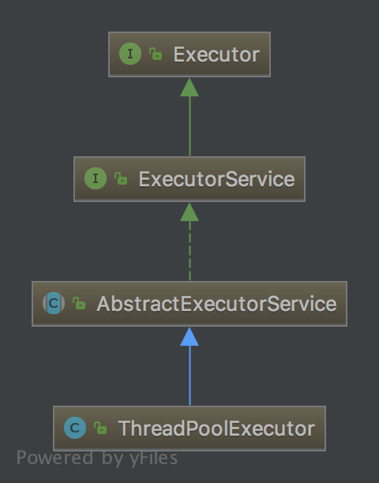

# ThreadPoolExecutor 源码剖析

<!-- TOC -->

- [概览](#概览)
    - [继承结构](#继承结构)
    - [状态转换](#状态转换)
    - [个性定制](#个性定制)
- [任务处理流程](#任务处理流程)
- [最佳实践](#最佳实践)
- [参考](#参考)

<!-- /TOC -->

---

## 概览

`ThreadPoolExecutor` 为每个提交的任务分配一个线程处理，是一种 `ExecutorService` 实现。通常使用 `Executors` 的工厂方法来进行配置。

因为减少了每个任务调度的开销，所以它能在执行大量异步任务的场景中提供更好的性能。并且它提供了一种限定和管理资源(比如线程)的方式。他也会保存一些基本的统计信息，比如已完成的任务数量。

一般情况下我们使用 `Executors` 的工厂方法来创建相应的实例。

1. `Executors.newCachedThreadPool()`，线程数量没有上界(`Integer.MAX_VALUE`)，有新任务提交并且没有空闲线程时，创建一个新线程执行该任务，每个线程空闲时间为 60s, 60s 空闲后线程会被移出缓存。使用 `SynchronousQueue` 作为任务队列的实现类。适用于执行大量生命周期短的异步任务。
1. `Executors.newFixedThreadPool(int)`，固定容量的线程池。使用 `LinkedBlockingQueue` 作为任务队列的实现类。当新任务到达时，创建新线程，当线程数达到上限时，将任务放到队列中，任务队列中任务数量没有上界。当线程创建之后就一直存在直至显式的调用 `shutdown()` 方法。
1. `Executors.newSingleThreadExecutor()`，单个 Worker 的线程池。和  `newFixedThreadPool(1)` 类似，区别在于这个实例经过了一次封装，不能对该实例的参数进行重配置，并且实现了 `finalize()` 方法，能够在 GC 时调用 `shutdown()` 方法关闭该线程池。

### 继承结构

`ThreadPoolExecutor` 实现了 `Executor` 和 `ExecutorService` 两个接口。

`Executor` 是执行已提交任务的对象。这个接口提供了一种分离任务提交和任务执行细节的机制。用户只需要通过 `execute()` 方法提交任务即可，不用显式的创建线程。但使用该接口并不意味着就是异步执行，比如我们实现一个 `Executor` 类，在 `execute(Runnable r)` 中直接调用任务的 `run()` 方法。

`ExecutorService` 提供了一些管理终止和能够输出 `Future` (用来跟踪异步任务进度)的方法。提供了两个用来 shutdown 的方法：

1. `shutdown()`。允许之前已提交的任务执行完毕。
1. `shutdownNow()`。不允许任务队列中的任务再执行并且试图去中断正在执行的任务。

`ExecutorService` 在不用时应该 shutdown 来允许回收其占用的资源。

### 状态转换

### 个性定制

## 任务处理流程

## 最佳实践

## 参考

1. [Java SE 9 & JDK 9 -- java.util.concurrent](https://docs.oracle.com/javase/9/docs/api/java/util/concurrent/package-summary.html)
1. [Java SE 9 & JDK 9 -- Executors](https://docs.oracle.com/javase/9/docs/api/java/util/concurrent/Executors.html)
1. [Java SE 9 & JDK 9 -- Executor](https://docs.oracle.com/javase/9/docs/api/java/util/concurrent/Executor.html)
1. [Java SE 9 & JDK 9 -- ExecutorService](https://docs.oracle.com/javase/9/docs/api/java/util/concurrent/ExecutorService.html)
1. [Java SE 9 & JDK 9 -- ThreadPoolExecutor](https://docs.oracle.com/javase/9/docs/api/java/util/concurrent/ThreadPoolExecutor.html)
1. [Java SE 9 & JDK 9 -- Source Code](.)
