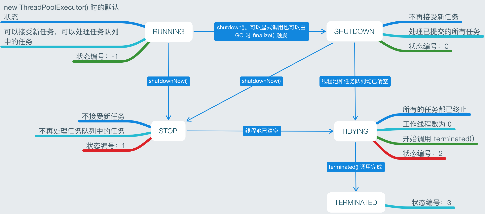
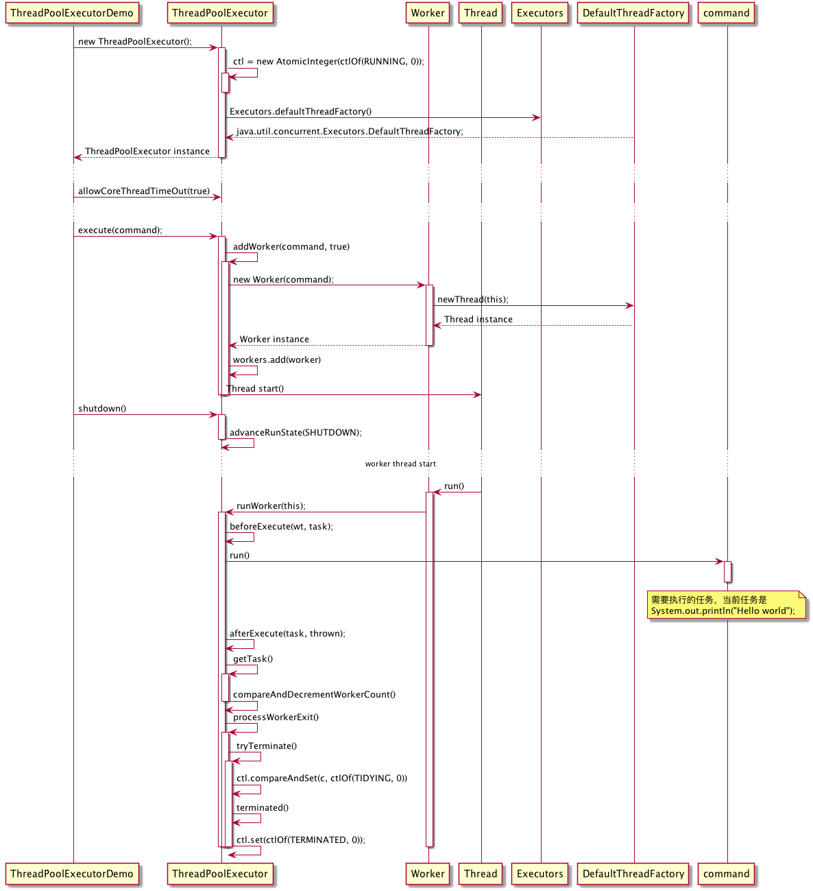

# ThreadPoolExecutor 源码剖析

源码基于 JDK9

---

<!-- TOC -->

- [概览](#概览)
    - [继承结构](#继承结构)
    - [状态转换](#状态转换)
    - [个性定制](#个性定制)
        - [Core and maximum pool sizes](#core-and-maximum-pool-sizes)
        - [On-demand construction](#on-demand-construction)
        - [Creating new threads](#creating-new-threads)
        - [Keep-alive times](#keep-alive-times)
        - [Queuing](#queuing)
        - [Rejected tasks](#rejected-tasks)
        - [Hook methods](#hook-methods)
        - [Queue maintenance](#queue-maintenance)
        - [Finalization](#finalization)
- [任务处理流程](#任务处理流程)
- [最佳实践](#最佳实践)
- [参考](#参考)

<!-- /TOC -->

---

## 概览

`ThreadPoolExecutor` 为每个提交的任务分配一个线程处理，是一种 `ExecutorService` 实现。通常使用 `Executors` 的工厂方法来进行配置。

因为减少了每个任务调度的开销，所以它能在执行大量异步任务的场景中提供更好的性能。并且它提供了一种限定和管理资源(比如线程)的方式。他也会保存一些基本的统计信息，比如已完成的任务数量。

一般情况下我们使用 `Executors` 的工厂方法来创建相应的实例。

1. `Executors.newCachedThreadPool()`，线程数量没有上界(`Integer.MAX_VALUE`)，有新任务提交并且没有空闲线程时，创建一个新线程执行该任务，每个线程空闲时间为 60s, 60s 空闲后线程会被移出缓存。使用 `SynchronousQueue` 作为任务队列的实现类。适用于执行大量生命周期短的异步任务。
1. `Executors.newFixedThreadPool(int)`，固定容量的线程池。使用 `LinkedBlockingQueue` 作为任务队列的实现类。当新任务到达时，创建新线程，当线程数达到上限时，将任务放到队列中，任务队列中任务数量没有上界。当线程创建之后就一直存在直至显式的调用 `shutdown()` 方法。
1. `Executors.newSingleThreadExecutor()`，单个 Worker 的线程池。和  `newFixedThreadPool(1)` 类似，区别在于这个实例经过了一次封装，不能对该实例的参数进行重配置，并且实现了 `finalize()` 方法，能够在 GC 时调用 `shutdown()` 方法关闭该线程池。

### 继承结构


`ThreadPoolExecutor` 实现了 `Executor` 和 `ExecutorService` 两个接口。

`Executor` 是执行已提交任务的对象。这个接口提供了一种分离任务提交和任务执行细节的机制。用户只需要通过 `execute()` 方法提交任务即可，不用显式的创建线程。但使用该接口并不意味着就是异步执行，比如我们实现一个 `Executor` 类，在 `execute(Runnable r)` 中直接调用任务的 `run()` 方法。

`ExecutorService` 提供了一些管理终止和能够输出 `Future` (用来跟踪异步任务进度)的方法。提供了两个用来 shutdown 的方法：

1. `shutdown()`。允许之前已提交的任务执行完毕。
1. `shutdownNow()`。不允许任务队列中的任务再执行并且试图去中断正在执行的任务。

`ExecutorService` 在不用时应该 shutdown 来允许回收其占用的资源。

### 状态转换



线程池的状态在 `ThreadPoolExecutor` 中的实际表示方式是一个 `AtomicInteger` 类型的成员变量的高三位(因为有 5 种状态)，名称为 `ctl`。

`ctl` 是 32 位的整型变量，他封装了两个变量：

1. 线程池运行状态。高三位。
    - RUNNING: 111
    - SHUTDOWN: 000
    - STOP: 001
    - TIDYING: 010
    - TERMINATED: 011
1. 有效工作线程数。低 29 位。

因为 `ctl` 是 `AtomicInteger` 的实例，其上的操作基于 CAS，是线程安全的。

1. `shutdown()`
    1. `advanceRunState(SHUTDOWN);` 首先将运行状态修改为 `SHUTDOWN`此时当有新任务提交时直接抛出 `RejectedExecutionException` 来拒绝服务。
    1. `interruptIdleWorkers()` 通过调用 Worker 线程的 `interrupt()` 方法试图中断空闲 worker。// todo `t.interrupt()` 方法会对那些线程状态有效？成功调用会产生什么影响？Java 的线程状态和操作系统内部线程状态之间有什么关系？此处涉及的知识面稍广，浪费了一些时间依旧没能理解，把 ThreadPoolExecutor 过完以后再系统解决。
    1. `tryTerminate()` 只对于运行状态为 `STOP` 或 `SHUTDOWN`+任务队列为空两种情况， 当 Worker 数量未减到 0 之前，每次调用会尝试中断一个 Worker 线程。当任务队列为不为空时，Worker 线程处理完正在处理的任务，会从工作队列中取出未处理的任务继续工作，循环这个过程至任务队列为空，Worker 获取不到要处理的任务时会将其从 Worker 集中移除，worker 数量减一，然后在 `processWorkerExit()` 方法中再次调用 `tryTerminate()` 。当 Worker 线程数量减到 0 以后再调用该方法时，会将运行状态修改为 `TIDYING` 并调用 `terminated()` 方法。`ThreadPoolExextor` 中该方法为空函数所以 `TIDYING` 和 `TERMINATED` 两个状态基本没有区别。
1. `shutdownNow()`
    1. `advanceRunState(STOP)` 首先将运行状态修改为 `STOP` 此时当有新任务提交时直接抛出 `RejectedExecutionException` 来拒绝服务。
    1. `interruptWorkers();`
    1. `drainQueue()`，直接清空任务队列
    1. `tryTerminate()`

### 个性定制

#### Core and maximum pool sizes

`ThreadPoolExecutor` 会依照 `corePoolSize` 和 `maximumPoolSize` 两个字段来动态调整线程池的大小。新任务提交过来时，如果当前活动的线程数少于 `corePoolSize` 会创建一个新线程来处理这个新任务即使当前有空闲线程。如果当前线程数大于 `corePoolSize` 小于 `maximumPoolSize` 且任务队列已满时也会创建新线程。

- 配置两个属性相等时可以获得固定容量的线程池。
- 将 `maximumPoolSize` 设为一个很大的数(比如 `Integer.MAX_VAlUE`)时，可以获得一个无上界的线程池，可以用来处理任意数量的并发任务。(Tips: 线程过多并不合适，因为物理机的 CPU 数量有限，无法同时处理那么多线程，只会白白占用资源，所以这个属性可以根据实际物理机 CPU 数量来配置。)

通常来说这两个属性，只通过构造器来配置，但是 `ThreadPoolExecutor` 也提供了 `setter` 方法可以在运行时配置。

#### On-demand construction

如果在构造 `ThreadPoolExecutor` 时，任务队列中已经有要处理的任务了，那么在创建好以后，可用通过直接调用 `prestartCoreThread()` 或 `prestartAllCoreThreads()` 来创建核心线程去处理这些任务。否则这些任务就只能在有新任务提交过来以后才能开始处理。

#### Creating new threads

新线程是通过 `ThreadFactory` 来创建的，如果在构造时未指定，就使用默认的 `java.util.concurrent.Executors.DefaultThreadFactory`。该 `ThreadFactory` 创建的线程都属于同一个线程组、`Thread.NORM_PRIORITY` 优先级、用户线程。

我们可以通过指定一个不同的线程工厂来修改线程名、线程组、优先级、线程守护状态等等。

#### Keep-alive times

如果当前线程数量超出了 `corePoolSize`，超出的那部分非核心线程会在空闲超出 `keepAliveTime` 时被终止。这能够线程池活跃状态不足时及时回收占用的资源。该参数也可以使用 `setKeepAliveTime(long, TimeUnit)` 来运行时动态修改。可以通过使用 `Long.MAX_VALUE TimeUnit.NANOSECONDS` 两个参数来禁用线程回收。默认情况下核心线程超时不回收，可以通过配置 `keepAliveTime` 和 `allowCoreThreadTimeOut` 来允许核心线程超时回收。

#### Queuing

任意的 `BlockingQueue` 实现都可以作为任务队列。任务队列的使用对线程池收缩会有一定影响：

- 如果当前线程数少于 `corePoolSize`，新提交的任务会直接提交给新创建的线程。
- 如果当前线程数不少于 `corePoolSize`，新提交的任务会提交到任务队列中。
- 如果新任务无法提交到任务队列(队列已满)，会尝试创建一个新线程，如果线程数达到了 `maximumPoolSize` 而导致新线程无法创建则该任务会被拒绝。

一般来说，任务队列有三种使用策略：

1. 直接交付。直接将到达的任务交付给线程，而不是将任务暂存起来。当没有空闲线程可用时直接新建线程。这种方式通常需要无上界的 `maximumPoolSize` 来防止拒绝服务。当然这种方式也有缺点，新任务到达的速度超过任务处理的速度时，新建的线程数量会越来越多。耗费内存。常常使用 `SynchronousQueue` 作为任务队列的实现类。
1. 无界队列。使用无界队列的话，执行任务的线程数不会超过 `corePoolSize` 的大小，但核心线程都无空闲时，新到的任务会添加到任务队列。当新任务到达的速度超过了任务处理的速度时，任务会积累的越来越多。常常使用 `LinkedBlockingQueue` 作为任务队列的实现类。
1. 有界队列。和有限的 `maximumPoolSize` 结合使用能够防止资源耗尽。但是队列的大小和 `maximumPoolSize` 的大小配置权衡起来会更难一些。大队列加小容量线程池可以最小化 CPU使用率、OS 资源和上下文切换的开销。但是有可能吞吐量会比较低，如果任务频繁阻塞(I/O操作)的话无法最优使用 CPU 资源。如果使用小队列加大容量的线程池，可以保证 CPU 的使用率，但是上下文调度的开销可能会过大，这也会降低吞吐量。常使用 `ArrayBlockingQueue` 作为任务队列的实现类。

#### Rejected tasks

1. `Executor` 状态不再是 `RUNNING`（已经被 `SHUTDOWN`）
1. 任务队列已满并且线程数量达到最大值，已达到饱和状态。

#### Hook methods

`ThreadPoolExecutor` 也提供了一些其他方法，子类可以重写这些方法来提供额外的支持：重新初始化 `ThreadLocals`，收集统计信息，添加日志等等。

1. `beforeExecute(Thread, Runnable)`， //任务执行前调用
1. `afterExecute(Runnable, Throwable)` //任务执行后调用
1. `terminated()` // `Executor` 状态转为 `TIDYING` 后调用

#### Queue maintenance

1. `getQueue()` 可以访问任务队列，但是只鼓励用于监控与调试。
1. `remove(Runnable)` 和 `purge()` 方法可以用于取消尚未执行的任务。`remove(Runnable)` 直接从任务队列删除，`purge()` 从任务队列批量删除已取消的 `Future`

#### Finalization

当线程池没有到 GC Roots 的引用并且 Worker 数为 0 时会被自动回收。

如果想要在忘记调用 `shutdown()` 时也能确保未被引用的线程池被回收的话，需要确保未使用的线程最终都被能终止。可以设置合适的 `keepAliveTime` 以及 `allowCoreThreadTimeOut`。

## 任务处理流程

我们以一个简单例子来剖析一下整个过程。

```java

package me.rainstorm;

import java.util.concurrent.ExecutorService;
import java.util.concurrent.LinkedBlockingDeque;
import java.util.concurrent.ThreadPoolExecutor;
import java.util.concurrent.TimeUnit;

/**
 *
 * @author baochen.zhang
 * @date 2017.12.4
 */
public class ThreadPoolExecutorDemo {
    private static final int THREAD_POOL_SIZE = Runtime.getRuntime().availableProcessors() + 2;
    private static ExecutorService exe = new ThreadPoolExecutor(THREAD_POOL_SIZE, THREAD_POOL_SIZE,
            60, TimeUnit.SECONDS, new LinkedBlockingDeque<>(100));

    {
        ((ThreadPoolExecutor)exe).allowCoreThreadTimeOut(true);
    }

    public static void main(String[] args) {
        exe.execute(() -> System.out.println("Hello world"));

        exe.shutdown();
        exe = null;
    }
}

```



1. `ctl` 变量之前已经提到了，作为一个控制变量用来控制线程池的状态和工作线程数。默认值是 `RUNNING | 0`，即状态为 `RUNNING`，Worker 线程数为 0;
1. 在 Demo 中并未指定线程工厂，`ThreadPoolExecutor` 使用 `Executors` 提供的默认线程工厂。
1. 因为只有一个任务，所以 `main` 方法中在提交完这个任务后，直接调用了 `shutdown()` 方法，并将其赋为 `null` 便于在任务执行完毕后回收资源，一般情况下推荐在所有任务都提交到线程池以后再调用 `shutdown`，否则之后的任务直接会被拒绝掉。
1. 因为只有一个任务，且允许核心线程超时，所以该线程在 `getTask()` 过程中会超时，然后返回 `null`，进入 `processWorkerExit()` 流程。
1. 线程池在进入 `TERMINATED` 状态后就可以被 GC 了。

## 最佳实践

一般情况下使用 `Executors` 的工厂方法来创建即可适用于大多数场景。需要配置的话参考 个性定制 来配置更合适自己项目的 `ThreadPoolExecutor`。

## 参考

1. [Java SE 9 & JDK 9 -- java.util.concurrent](https://docs.oracle.com/javase/9/docs/api/java/util/concurrent/package-summary.html)
1. [Java SE 9 & JDK 9 -- Executors](https://docs.oracle.com/javase/9/docs/api/java/util/concurrent/Executors.html)
1. [Java SE 9 & JDK 9 -- Executor](https://docs.oracle.com/javase/9/docs/api/java/util/concurrent/Executor.html)
1. [Java SE 9 & JDK 9 -- ExecutorService](https://docs.oracle.com/javase/9/docs/api/java/util/concurrent/ExecutorService.html)
1. [Java SE 9 & JDK 9 -- ThreadPoolExecutor](https://docs.oracle.com/javase/9/docs/api/java/util/concurrent/ThreadPoolExecutor.html)
1. [Java SE 9 & JDK 9 -- Source Code](.)
1. [What is Daemon thread in Java?](https://stackoverflow.com/questions/2213340/what-is-daemon-thread-in-java)
1. [深入理解java线程池—ThreadPoolExecutor](http://www.jianshu.com/p/ade771d2c9c0)
1. [Java 中, 为什么一个对象的实例方法在执行完成之前其对象可以被 GC 回收?](https://www.zhihu.com/question/51244545)
