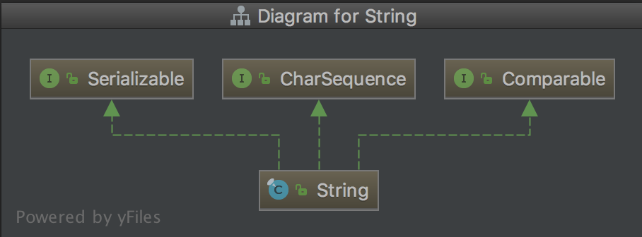

# java.lang.String

- 基于 Java9
- Tips: 预备知识，建议掌握以后再继续向下看。[Unicode 学习笔记](../common/unicodeStandard.md)

---

<!-- TOC -->

- [概览](#概览)
- [继承结构](#继承结构)
    - [Serializable](#serializable)
    - [CharSequence](#charsequence)
    - [Comparable<T>](#comparablet)
- [字符集简介](#字符集简介)
- [重要域成员](#重要域成员)
- [重要方法](#重要方法)
    - [代码点及代码单元](#代码点及代码单元)
    - [比较](#比较)
    - [搜索](#搜索)
    - [提取子串](#提取子串)
    - [创建全大写/全小写副本](#创建全大写全小写副本)
- [一些体会](#一些体会)
- [参考](#参考)

<!-- /TOC -->

---

## 概览

`String` 类代表了字符串。所有类似于 `"abc"` 的字符串字面量都是该类的实例。

字符串是常量，从创建后就不可更改。需要修改的字符串可以使用 `StringBuffer`。因为 `String` 实例不可变，所以他们可以安全的共享。一些例子：

```java
String str = "abc";
// 与上面一行代码效果相同
char data[] = {'a', 'b', 'c'};
String str = new String(data);


System.out.println("abc");
String cde = "cde";
System.out.println("abc" + cde);
String c = "abc".substring(2,3);
String d = cde.substring(1, 2);
```

`String` 类也包含了一些对单个字符的操作、比较、搜索、提取子串、创建全大写/全小写副本的方法。

Java 语言为字符串连接操作符(+)添加了特殊支持。向左连接。

```java
//  example 1
"The square root of 2 is " + Math.sqrt(2)
  |
  v
"The square root of 2 is 1.4142135623730952"

// example 2
1 + 2 + " fiddlers"
  |
  v
"3 fiddlers"

// example 3
"fiddlers " + 1 + 2
  |
  v
"fiddlers 12"

```

`String` 使用 UTF-16 来编码（一个字符两个字节或四个字节）。拓展字符用 surrogate pairs 来表示，占用四个字节。（PS：该术语是编码领域的，可以参考之前写的一篇笔记: [Unicode 学习笔记](../common/unicodeStandard.md)）

`String` 也提供了一些处理代码点(Unicode code points)和代码单元(Unicode code units)的方法(PS:这两个也是编码领域术语，可以参考：[Unicode 学习笔记](../common/unicodeStandard.md))。

String 连接操作符的具体实现留给 Java 编译器来决定，只要编译器能够完全遵循 Java 语言规范即可。例如 `javac` 编译器可能用 `StringBuffer`、`StringBuilder` 或 `java.lang.invoke.StringCOncatFactory` 来实现。

## 继承结构



### Serializable

类通过实现 `java.io.Serializable` 接口来启用序列化能力。未实现该接口的类其状态将不会被序列化(抛出 `NotSerializableException` 异常)。该接口没有任何域或方法，只是表示可序列化的语义。

```java
    public static void serializableTest() throws IOException, ClassNotFoundException {
        String outputfile = "/Users/chen/Desktop/serializable";
        ST instance = new ST();

        ObjectOutputStream outputStream = new ObjectOutputStream(new FileOutputStream(outputfile));
        outputStream.writeObject(instance);
        outputStream.close();

        ObjectInputStream inputStream = new ObjectInputStream(new FileInputStream(outputfile));
        ST newInstance = (ST) inputStream.readObject();
        inputStream.close();

        System.out.println(newInstance);
        System.out.println(instance.equals(newInstance));  // true
        System.out.println(instance == newInstance); //false
    }

    static class ST implements Serializable{
        public int publicField = 1;
        protected int protectedField = 1;
        int defaultField = 1;
        private int privateField = 1;

        @Override
        public boolean equals(Object o) {
            if (this == o) {
                return true;
            }
            if (o == null || getClass() != o.getClass()) {
                return false;
            }
            ST st = (ST) o;
            return publicField == st.publicField &&
                    protectedField == st.protectedField &&
                    defaultField == st.defaultField &&
                    privateField == st.privateField;
        }

        @Override
        public int hashCode() {
            return Objects.hash(publicField, protectedField, defaultField, privateField);
        }

        @Override
        public String toString() {
            return "ST{" +
                    "publicField=" + publicField +
                    ", protectedField=" + protectedField +
                    ", defaultField=" + defaultField +
                    ", privateField=" + privateField +
                    '}';
        }
    }
```

序列化的对象中引用的所有对象都必须实现了该接口，否则也会抛出 `NotSerializableException` 异常。

### CharSequence

一个 `CharSequence` 是一个只读的 `char` 序列。该接口为不同的实现提供了统一的只读访问。

该接口并没有重新定义 `equals() & hashCode()` 方法，直接比较两个实现类的实例结果是未定义的。所以将 `CharSequence` 的实例作为 `set` 的元素或 `map` 的 `key` 是不合适的。

主要的实现类：`CharBuffer, Segment, String, StringBuffer, StringBuilder`

`String` 中也实现了与 `CharSequence` 实例进行比较、拼接等操作的函数。

### Comparable<T>

主要用于集合中元素排序，两个元素直接比较。

## 字符集简介

`String` 类中用到了两种字符集 `Latin1 & UTF-16`. `Latin1` 拓展了 `ASCII` 编码，但是也是用一个字节来表示，`UTF-16` 使用两个或四个字节表示一个字符。简要介绍请看：[Unicode 学习笔记](../common/unicodeStandard.md)

```java
/**
    在构造一个 String 对象时，String 会尝试对传入的参数进行压缩。比如

    String latin1 = new String("latin1".toCharArray());
    String utf16 = new String("使用 UTF-16 字符集".toCharArray());

    入参是 char[]，java 中 char 是两个字节，byte 是一个字节，压缩后 latin1 的 value 字段是 6 个 byte，utf16 无法进行压缩，所以依旧是 26 个 byte。

    下面是 java.lang.StringUTF16 中进行压缩的函数。
 */
    // compressedCopy char[] -> byte[]
    @HotSpotIntrinsicCandidate
    public static int compress(char[] src, int srcOff, byte[] dst, int dstOff, int len) {
        for (int i = 0; i < len; i++) {
            char c = src[srcOff];
            if (c > 0xFF) {     // 超出了 LATIN1 所能表示的范围，直接返回不再压缩
                len = 0;
                break;
            }
            dst[dstOff] = (byte)c;
            srcOff++;
            dstOff++;
        }
        return len;
    }
```

## 重要域成员

1. `private final byte[] value;`
    - 用来存储字符串的字节序列。
1. `private final byte coder;`
    - 用来暗示 `value` 中的字节数组的编码方式。有 `LATIN1 & UTF16` 可选。
    - `static final byte LATIN1 = 0;`
    - `static final byte UTF16  = 1;`
1. `private int hash;`
    - 缓存字符串哈希值。默认是 0. 在 首次调用 `hashCode()` 方法时计算并缓存。
1. `static final boolean COMPACT_STRINGS;`
    - 用来决定 `value` 是否进行压缩，默认是 true（压缩）。如果是 false 的话那么总是使用 UTF16 来编码字符串的字节流。在 `String` 类中，该域使用静态初始化块进行初始化。

## 重要方法

- TIPS：本来计划中有这部分的内容，但是读过源码理解了字符集的概念和 `String` 的处理方式以后感觉这部分就不需要再写了，有兴趣可以自己看。

### 代码点及代码单元

### 比较

### 搜索

### 提取子串

### 创建全大写/全小写副本

## 一些体会

理解 `String` 类最重要的不是会用 `String` 的 API，而是对字符集本身的理解，字符集是什么，它解决了什么问题，字符是怎么编码的等等，只有很好的理解了字符集才能很好的理解 `String` 的行为。

## 参考

1. [java.lang.String](https://docs.oracle.com/javase/9/docs/api/java/lang/String.html)
1. [15.18.1. String Concatenation Operator +](https://docs.oracle.com/javase/specs/jls/se9/html/jls-15.html#jls-15.18.1)
1. [Serializable](https://docs.oracle.com/javase/9/docs/api/java/io/Serializable.html)
1. [JAVA 对象序列化（一）——Serializable](http://www.cnblogs.com/chenfei0801/archive/2013/04/05/3001149.html)
1. [CharSequence](https://docs.oracle.com/javase/9/docs/api/java/lang/CharSequence.html)
1. [ISO/IEC 8859-1](https://en.wikipedia.org/wiki/ISO/IEC_8859-1)
