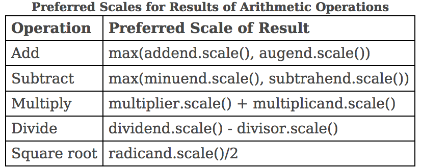
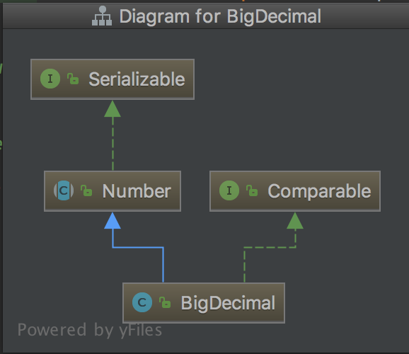
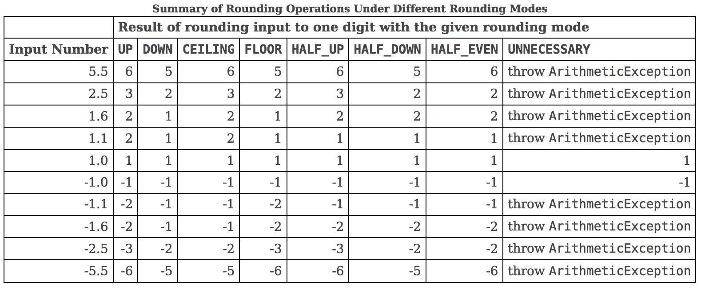

# java.lang.BigDecimal

基于 JDK9

---

<!-- TOC -->

- [概览](#概览)
- [继承结构](#继承结构)
    - [`Number`](#number)
- [重要相关类](#重要相关类)
    - [`RoundingMode`](#roundingmode)
    - [`MathContext`](#mathcontext)
    - [`BigInteger`](#biginteger)
- [重要域成员](#重要域成员)
- [重要成员方法](#重要成员方法)
    - [算数操作](#算数操作)
    - [缩放](#缩放)
- [最佳实践](#最佳实践)
- [参考](#参考)

<!-- /TOC -->

---

## 概览

不可变的任意精度有符号十进制数。 `BigDecimal` 用一个任意精度整数和一个缩放比例来表示一个数。精度是从左侧第一个非 0 数字开始到最后一个数字为止的数字个数。一些例子：

|表示的数|精度|整数域|缩放比例|计算方式|
|---:|---:|---:|---:|---:|
|100|3|100|0|100*(E-0)|
|0.01|1|1|2|1*(E-2)|
|100.001|6|100001|3|100001*(E-3)|
|100000000000000000000.01|22|1000000000000000000001|2|1000000000000000000001*(E-2)|

注意：缩放比例一般是非负数（整数是 0，小数是正数，当计算结果的整数部分位数大于精度时会是负数），缩放比例也可以手动调用 `setScale()` 方法修改为负数，缩放比例为负数时意味着小数点前移，有可能会损失精度（比如：109，本来整数域是 109、缩放比例是 0，若缩放比例改为 -1 的话，整数域就需要变为 10 或 11，而这两种方式都无法准确表示原来的 109）。在调用 `setScale()` 时需要指定舍入策略，否则整数域无法判断是记为 10 还是 11，demo 请看 **重要成员方法-setScale()**。

`BigDecimal` 提供了一些算数、缩放、舍入、比较、哈希、格式转换操作。 `toString()` 方式提供了一种规范的展示方式(PS：IDEA 在显示 debug 信息时会调用对象的 `toString()` 方法。如果在实例真正的创建完成之前加断点停住了，那么这个 `BigDecimal` 实例就永远也得不到正确的 String 方式的展示了。

`BigDecimal` 把舍入行为的控制权完全交给了使用者。如果未指定舍入模式并且计算结果无法被精确记录会直接抛出一个 `ArithmeticException`。若在计算时指定了 `MathContext`，那么结果会以 `MathContext` 所定义的精度和舍入规则来保留。

```java
BigDecimal one = BigDecimal.ONE;
BigDecimal three = new BigDecimal("3");

BigDecimal result = one.divide(three); // 1/3 是无限循环小数，所以会抛异常

BigDecimal result = one.divide(three, RoundingMode.UP); // 1

BigDecimal result = one.divide(three, new MathContext(7, RoundingMode.HALF_UP)); // 0.3333333
```

当指定的 `MathContext` 实例的精度是 0 时，和未指定该参数的效果是一样的，此时 `MathContext` 中的 `RoundingMode` 并未使用，所以结果与该值无关。

通常来说，舍入策略和精度决定了计算结果。精度决定计算结果的数字个数，舍入策略决定了如何舍弃尾部的数字。

算数操作结果的缩放比例，除运算可能会使用更大的缩放比例，其他的运算遵循表格中的计算方式：



比如

```java
BigDecimal dividend = BigDecimal.ONE;          // scale : 0
BigDecimal divisor = new BigDecimal("32");     // scale : 0
BigDecimal result = dividend.divide(divisor);  // scale : 5
```

算数操作会先计算出一个中间结果（逻辑上的，实际本不存在这个实例），然后根据舍入规则和精度对该中间结果进行再次处理，得到的才是最后的结果。

**注意：`equal() & hashCode()` 方法在实现时，只有缩放比例和整数域两个值都相等才会判定两个实例相等，所以将 `BigDecimal` 的实例做为 `SortedMap & SortSet` 的 key时需要注意这一点**

## 继承结构



### `Number`

该类是一个抽象类，是 Java 平台所有数字类的父类。它提供了一些抽象方法接口将数字类转换为各种基本数据类型。这些方法由具体的数字类来实现。转换的过程可能会丢失精度、甚至改变符号。

一些子类：`AtomicInteger, AtomicLong, BigDecimal, BigInteger, Byte, Double, DoubleAccumulator, DoubleAdder, Float, Integer, Long, LongAccumulator, LongAdder, Short`

## 重要相关类

### `RoundingMode`

该类是一个枚举类，枚举了 8 种舍入类型：

1. `CEILING`。向正无穷舍入
1. `FLOOR`。向负无穷舍入
1. `DOWN`。向 0 舍入
1. `UP`。与 `DOWN` 相反。
1. `HALF_UP`。五入
1. `HALF_DOWN`。五舍
1. `HALF_EVEN`。五向偶数方向舍入。
1. `UNNECESSARY`。表示一定会得到精确结果，得不到时抛异常。



### `MathContext`

封装了精度及舍入规则，用于算数运算。

预定义的一些规则：

```java
//精度为 0，相当于没有配置
public static final MathContext UNLIMITED =
                new MathContext(0, RoundingMode.HALF_UP);

// 精度为 7，舍入策略为 HALF_EVEN
public static final MathContext DECIMAL32 =
                new MathContext(7, RoundingMode.HALF_EVEN);

// 精度为 16，舍入策略为 HALF_EVEN
public static final MathContext DECIMAL64 =
                new MathContext(16, RoundingMode.HALF_EVEN);

// 精度为 34，舍入策略为 HALF_EVEN
public static final MathContext DECIMAL128 =
                new MathContext(34, RoundingMode.HALF_EVEN);
```

### `BigInteger`

任意精度的整数。底层存储方式也是 bits 位，与基本类型的区别在于，基本类型 `int` 固定 32bits，`BigInteger` 的 bits 存储在一个 `int[]` 中，所以他可以表示很大的整数。比如 2^128 的二进制表示是 `100...000(1+128个0)` 一共 129 位，存放在长度为 `Math.ceil(129.0/32)` 的数组中。不再赘述，有兴趣自己查看源码。

## 重要域成员

1. `private final BigInteger intVal;`
    - 整数域。(整数域超过 18 位时使用)
1. `private final transient long intCompact;`
    - 整数域。整数域在 long 能够表示的范围内使用，超出能表示范围会被赋为 `Long.MIN_VALUE`，代表整数域此时使用 `intVal` 来表示
1. `private final int scale;`
    - 缩放比例。也代表小数点右侧的数字数，整数域相同，缩放比例越大表示的数越小。
1. `private transient int precision;`
    - 精度。代表从左侧第一个非 0 数字开始到最后一个数字为止的数字个数。 `precision - scale` 值为正数时代表整数部分的位数。负数时表示小数点右侧 0 的个数且该数小于 1。
1. `private transient String stringCache;`
    - `String` 表示的缓存。该值只赋值一次。

预缓存的 `BigDecimal`

1. `public static final BigDecimal ZERO`
1. `public static final BigDecimal ONE`
1. `public static final BigDecimal TEN`

## 重要成员方法

为了简化描述方式下面使用 `[整数域，缩放比例]` 来表示 `BigDecimal` 实例。例如 `0.19 --> [19（整数域）, 2（缩放比例）, 2（精度，可选）]` 来表示，中间结果只是逻辑上存在，实际上并不存在这个实例。

### 算数操作

1. `Add`
    - `[19, 2] + [19, 2] = [38, 2]`
    - `[19, 2] + [19, 1] = [19, 2] + [190, 2] =  [209, 2]`
1. `Subtract`
    - `[19, 2] - [10, 2] = [19, 2] + [-10, 2] = [9, 2]`
1. `multiply`
    - `[1, 2] * [3, 4] = [3(1*3), 6(2+4)]`
1. `divide`
    - `divide(BigDecimal): [19, 2] / [100, 0] = [19*E+12, 14] / [100, 0] = [19*E+10, 14] = [19, 4]`
    - 此时未指定特定的 `MathContext`, 所以使用了默认值 `new MathContext( (int)Math.min(this.precision() + (long)Math.ceil(10.0*divisor.precision()/3.0),
    Integer.MAX_VALUE),
    RoundingMode.UNNECESSARY);` 即精度为 2+10*3/3 = 12，舍入方法为 `UNNECESSARY`
    - `14 = MathContext.precision + preferredScale = 12 + 2 - 0`
    - 化简一下得到最后结果
1. 其他运算有兴趣可以自己看源码。

### 缩放

`BigDecimal` 提供了两种类型的方法来操作缩放比例。

1. `setScale() & round()`。返回一个与原来实例近似或完全相等的实例，只是缩放比例或精度为指定的值(精度=缩放比例+整数部分位数，当 `BigDecimal` 整数部分为 0 时，调整缩放比例就是调整精度)。
    - `setScale(1, RoundingMode.UP): [19, 2] -> [2, 1]`
    - `setScale(3): [19, 2] -> [190, 3]`
    - `round(mc(1, RoundingMode.UP)): [19, 2, 2] -> [2, 1, 1]`
    - `round(mc(3, RoundingMode.UNNECESSARY)) : [19, 2, 2] -> [190, 3, 3]`
1. `movePointLeft() & movePointRight()`。直接增大/减小缩放比例。
    - `movePointLeft(1): [19, 2] -> [19, 3]`
    - `movePointright(1): [19, 2] -> [19, 1]`

## 最佳实践

1. 使用参数为 `String` 的构造参数。javadoc 中提到使用参数为 double 的构造参数有时会有出现不可预料的问题。
1. 比较时使用 `compareTo() / signum()` 方法。概览中最后有提到不使用 `equals()` 的原因。
1. 目前能想到的就这么多，如果你有其他想法可以给我提 `issue`

## 参考

1. [Class BigDecimal](https://docs.oracle.com/javase/9/docs/api/java/math/BigDecimal.html)
1. [Setting scale to a negative number with BigDecimal -- stackoverflow](https://stackoverflow.com/questions/21590590/setting-scale-to-a-negative-number-with-bigdecimal)
1. [Class Number](https://docs.oracle.com/javase/9/docs/api/java/lang/Number.html)
1. [Enum RoundingMode](https://docs.oracle.com/javase/9/docs/api/java/math/RoundingMode.html)
1. [Class MathContext](https://docs.oracle.com/javase/9/docs/api/java/math/MathContext.html)
1. [Class BigInteger](https://docs.oracle.com/javase/9/docs/api/java/math/BigInteger.html)
1. [How to Use Java BigDecimal: A Tutorial](http://www.opentaps.org/docs/index.php/How_to_Use_Java_BigDecimal:_A_Tutorial#The_Problem)
