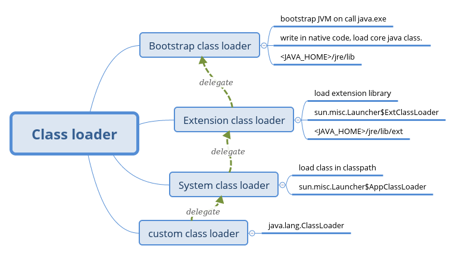
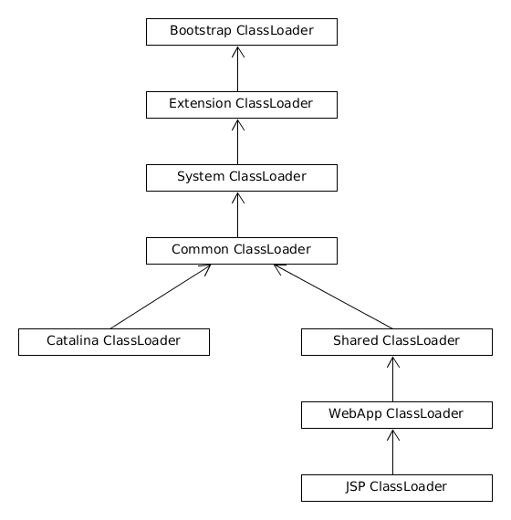

# 谈谈 Java 类加载机制

最近在学习 Tomcat 架构，其中很重要的一个模块是类加载器，因为以前学习的不够深入，所以趁这个机会好好把类加载机制搞明白。

<!-- TOC -->

- [Overview](#overview)
- [API for class loading](#api-for-class-loading)
    - [`java.lang.ClassLoader`](#javalangclassloader)
    - [`java.security.SecureClassLoader`](#javasecuritysecureclassloader)
    - [`java.net.URLClassLoader`](#javaneturlclassloader)
- [Tomcat 8.5.15 class loading Mechanism](#tomcat-8515-class-loading-mechanism)
- [Reference](#reference)

<!-- /TOC -->

---

## Overview



类加载器主要分为两类，一类是 JDK 默认提供的，一类是用户自定义的。
JDK 默认提供三种类加载器

1. `Bootstrap ClassLoader`，启动类加载器，每次执行 `java` 命令时都会使用该加载器为虚拟机加载核心类。该加载器是由 `native code` 实现，而不是 Java 代码，加载类的路径为 `<JAVA_HOME>/jre/lib`。特别的 `<JAVA_HOME>/jre/lib/rt.jar` 中包含了 `sun.misc.Launcher` 类， 而 `sun.misc.Launcher$ExtClassLoader` 和 `sun.misc.Launcher$AppClassLoader` 都是 `sun.misc.Launcher` 的内部类，所以拓展类加载器和系统类加载器都是由启动类加载器加载的。
1. `Extension ClassLoader`, 拓展类加载器，用于加载拓展库中的类。拓展库路径为 `<JAVA_HOME>/jre/lib/ext/`。实现类为 `sun.misc.Launcher$ExtClassLoader`
1. `System ClassLoader`, 系统类加载器。用于加载 CLASSPATH 中的类。实现类为 `sun.misc.Launcher$AppClassLoader`

用户自定义的类加载器

1. `Custom ClassLoader`, 一般都是 `java.lang.ClassLoder` 的子类

正统的类加载机制是基于双亲委派的，也就是当调用类加载器加载类时，首先将加载任务委派给双亲，若双亲无法加载成功时，自己才进行类加载。

在实例化一个新的类加载器时，我们可以为其指定一个 `parent`，即双亲，若未显式指定，则 `System ClassLoader` 就作为默认双亲。

具体的说，类加载任务是由 `ClassLoader` 的 `loadClass()` 方法来执行的，他会按照以下顺序加载类：

1. 通过 `findLoadedClass()` 看该类是否已经被加载。该方法为 native code 实现，若已加载则返回。
1. 若未加载则委派给双亲，`parent.loadClass()`，若成功则返回
1. 若未成功，则调用 `findClass()` 方法加载类。`java.lang.ClassLoader` 中该方法只是简单的抛出一个 `ClassNotFoundException` 所以，自定义的 ClassLoader 都需要 Override `findClass()` 方法

## API for class loading

### `java.lang.ClassLoader`

- `ClassLoader` 是一个抽象类。
- 待加载的类必须用 `The Java™ Language Specification` 定义的全类名，全类名的定义请查阅 [The Form of a Binary](https://docs.oracle.com/javase/specs/jls/se8/html/jls-13.html#jls-13.1)。
- 给定一个全类名，类加载器应该去定位该类所在的位置。通用的策略是将全类名转换为类文件路径，然后通过类文件路径在文件系统中定位。
- 每一个加载到内存的类都由一个 Class 对象来表示，每一个 Class 对象都有一个指向加载该类的类加载器的引用。但是数组的 Class 对象是由 Java 运行时环境创建的，通过 `Class.getClassLoader()` 方法返回的是数组元素的类加载器，若数组元素是基本类型，则返回 `null`，若类是由 `Bootstrap ClassLoader` 加载的话也是返回 `null`
    ```java
    public class Main {
        public static void main(String[] args) {
            // Object 类在 <java_home>/jre/lib/rt.jar 中，
            // 由 Bootstrap ClassLoader 加载，由于该类加载器是由 native code 编写
            // 所以输出为 null
            Object[] objects = new Object[5];
            System.out.println();
            System.out.println(objects.getClass().getClassLoader());

            // ZipFileAttributes 类在 <java_home>/jre/lib/ext/zipfs.jar 中，
            // 由 Extension ClassLoader 加载，
            // 输出为  sun.misc.Launcher$ExtClassLoader@4b67cf4d
            ZipFileAttributes[] attributes = new ZipFileAttributes[5];
            System.out.println();
            System.out.println(attributes.getClass().getClassLoader());

            // Main 类是自定义的类，
            // 默认由 System ClassLoader 加载，
            // 输出为 sun.misc.Launcher$AppClassLoader@18b4aac2
            Main[] array = new Main[5];
            array[0] = new Main();
            System.out.println();
            System.out.println(array.getClass().getClassLoader());
        }
    }
    ```
- `ClassLoader` 默认支持并行加载，但是其子类必须调用 `ClassLoader.registerAsParallelCapable()` 来启用并行加载
- 一般来说,JVM 从本地文件系统加载类的行为是与平台有关的。
- `defineClass()` 方法可以将字节流转换成一个 `Class` 对象。然后调用 `Class.newInstance()` 来创建类的实例

### `java.security.SecureClassLoader`

增加了一层权限验证，因为关注点不在安全，所以暂不讨论。

### `java.net.URLClassLoader`

该类加载器用来加载 URL 指定的 JAR 文件或目录中的类和资源，以 `/` 结尾的 URL 认为是目录，否则认为是 JAR 文件。

```java
// 尝试通过 URLClassLoader 来加载桌面下的 Test 类。
public class Main {
    public static void main(String[] args) {
        try {
            URL[] urls = new URL[1];
            URLStreamHandler streamHandler = null;
            File classPath = new File("/home/chen/Desktop/");
            String repository = (new URL("file", null,
                    classPath.getCanonicalPath() + File.separator))
                    .toString();
            urls[0] = new URL(null, repository, streamHandler);

            ClassLoader loader = new URLClassLoader(urls);

            Class testClass = loader.loadClass("Test");

            // output:  java.net.URLClassLoader@7f31245a
            System.out.println(testClass.getClassLoader());
        } catch (MalformedURLException e) {
            e.printStackTrace();
        } catch (IOException e) {
            e.printStackTrace();
        } catch (ClassNotFoundException e) {
            e.printStackTrace();
        }
    }
}
```

## Tomcat 8.5.15 class loading Mechanism



Tomcat 使用正统的类加载机制(双亲委派),但部分地方做了改动。

- `Bootstrap classLoader` 和 `Extension classLoader` 的作用不变
- `System classLoader` 正常情况下加载的是 `CLASSPATH` 下的类，但是 Tomcat 的启动脚本并未使用该变量，而是从以下仓库下加载类：

    1. `$CATALINA_HOME/bin/bootstrap.jar` 包含了 Tomcat 的启动类。在该启动类中创建了 `Common classLoader`、`Catalina classLoader`、`shared classLoader`。因为 `$CATALINA_BASE/conf/catalina.properties` 中只对 `common.loader` 属性做了定义，`server.loader` 和 `shared.loader` 属性为空，所以默认情况下，这三个 classLoader 都是 `CommonLoader`。具体的代码逻辑可以查阅 `org.apache.catalina.startup.Bootstrap` 类的 `initClassLoaders()` 方法和 `createClassLoader()` 方法。
    1. `$CATALINA_BASE/bin/tomcat-juli.jar` 包含了 Tomcat 日志模块所需要的实现类
    1. `$CATALINA_HOME/bin/commons-daemon.jar`
- `Common classLoader` 是位于 Tomcat 应用服务器顶层的公用类加载器。由其加载的类可以由 Tomcat 自身类和所有应用程序使用。扫描路径由 `$CATALINA_BASE/conf/catalina.properties` 文件中的 `common.loader` 属性定义。默认是 `$CATALINA_HOME/lib`.
- `catalina classLoader` 用于加载服务器内部可见类，这些类应用程序不能访问。
- `shared classLoader` 用于加载应用程序共享类，这些类服务器不会依赖。
- `Webapp classLoader` 。每个应用程序都会有一个独一无二的 `webapp classloader`，他用来加载本应用程序 `/WEB-INF/classes` 和 `/WEB-INF/lib` 下的类。

特别的：

`Webapp classLoader` 的默认行为会与正常的双亲委派模式不同：

1. 从 `Bootstrap classloader` 加载
1. 若没有，从 `/WEB-INF/classes` 加载
1. 若没有，从 `/WEB-INF/lib/*.jar` 加载
1. 若没有，则依次从 `System`、`Common`、`shared` 加载（该步骤使用双亲委派）

当然了，我们也可以通过配置来使 `Webapp classLoader` 严格按照双亲委派模式加载类：

1. 通过在工程的 `META-INF/context.xml`（和 `WEB-INF/classes` 在同一目录下） 配置文件中添加 `<Loader delegate="true"/>`
1. 因为 `Webapp classLoader` 的实现类是 `org.apache.catalina.loader.WebappLoader`，他有一个属性叫 `delegate`， 用来控制类加载器的加载行为，默认为 `false`，我们可以使用 `set` 方法，将其设为 `true` 来启用严格双亲委派加载模式。

严格双亲委派模式加载步骤：

1. 从 `Bootstrap classloader` 加载
1. 若没有，则依次从 `System`、`Common`、`shared` 加载
1. 若没有，从 `/WEB-INF/classes` 加载
1. 若没有，从 `/WEB-INF/lib/*.jar` 加载

## Reference

1. [The Java Class Loading Mechanism](https://docs.oracle.com/javase/tutorial/ext/basics/load.html)
1. [Java Classloader](https://en.wikipedia.org/wiki/Java_Classloader)
1. [Class Loader HOW-TO - Apache Tomcat 8](https://tomcat.apache.org/tomcat-8.5-doc/class-loader-howto.html)
1. [《Tomcat 架构解析》]()
1. [《深入理解 Java 虚拟机》]()
