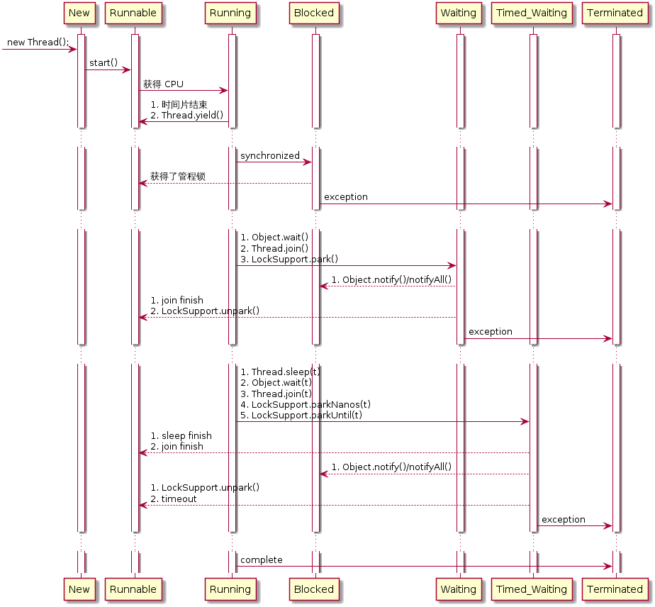

# 谈谈 Java 线程状态转换

本文只有一张图，想要完全理解这张图，需要去读一下 Reference 中提到的资料。

---

## Reference

1. [Thread.State(Java™ Platform SE 8)](https://docs.oracle.com/javase/8/docs/api/java/lang/Thread.State.html)
1. [Java Thread States and Life Cycle -- 强烈推荐](http://www.uml-diagrams.org/java-thread-uml-state-machine-diagram-example.html)
1. [【线程的状态转换】 - 每天进步一点点！ - ITeye博客](http://uule.iteye.com/blog/1100799)
1. [Java线程中wait状态和block状态的区别?](https://www.zhihu.com/question/27654579)
1. [JVM源码分析之Object.wait/notify实现](http://www.jianshu.com/p/f4454164c017)
