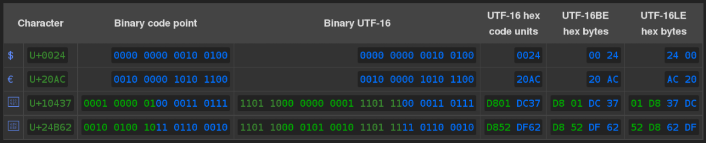
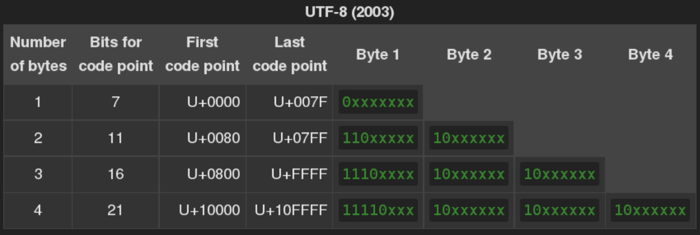
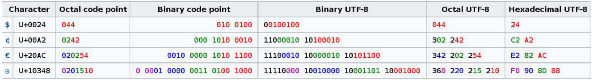

# Unicode 学习笔记

## Unicode encoding model

> The four levels of the Unicode Character Encoding Model can be summarized as:
> - ACR: Abstract Character Repertoire 
        the set of characters to be encoded, for example, some alphabet or symbol set
> - CCS: Coded Character Set 
        a mapping from an abstract character repertoire to a set of nonnegative integers
> - CEF: Character Encoding Form 
        a mapping from a set of nonnegative integers that are elements of a CCS to a set of sequences of particular code units of some specified width, such as 32-bit integers
> - CES: Character Encoding Scheme 
        a reversible transformation from a set of sequences of code units (from one or more CEFs to a serialized sequence of bytes)

> In addition to the four individual levels, there are two other useful concepts:
> - CM: Character Map 
        a mapping from sequences of members of an abstract character repertoire to serialized sequences of bytes bridging all four levels in a single operation
> - TES: Transfer Encoding Syntax  
        a reversible transform of encoded data, which may or may not contain textual data
            
> [Unicode Character Encoding Model -- unicode.org][Unicode Character Encoding Model -- unicode.org]

- 四个层次
    1. 抽象字符层(ACR)。比如我们平时使用的文字就是抽象字符。
    1. 码化字符集(CCS)。所有抽象字符映射为一系列非负数（Code point）。
    1. 字符编码方式(CEF)。将上一层的整数转为代码单元（code unit）的集合。
    1. 字符编码模式(CES)。由一系列代码单元（code unit）组成的模式。例如 UTF-8、UTF-16 等等

## 基本概念

1. [Code point（0x0 - 0x10FFFF）][Code point]
    - 表示法 `U+1FFFF`. （`U+` + 一个十六进制数）
    - 一个代码点，是一个数字，代表一个字符。
    - 同一个代码点在不同的编码格式中占用的空间大小有可能不同。比如，UTF-32 中所有代码点都是 4 个字节， UTF-8 中 代码点是可变长的 1-4 字节
1. code unit

    > Code unit: The minimal bit combination that can represent a unit of encoded text for processing or interchange.
    - 在一个 CES 中，能表示一个字符的最小位组合数。UTF-8 为 8 bits，UTF-16 为 16 bits，UTF-32 为 32 bits。
1. [UTF-32(UCS-4)][UTF-32]
    - 固定 4 个字节（32 bits）长度， 不管是 [BMP][BMP]，还是 [SMP][SMP]，不足 4 字节使用前导 0 代替。
1. UCS-2
    - 固定 2 字节（16 bits）。只能表示 [BMP][BMP]
1. [UTF-16][UTF-16]
    - 前身为 UCS-2， 但其不能表示 [SMP][SMP]，为弥补该缺陷产生了 [UTF-16][UTF-16]。
    - 2 或 4 字节（16 or 32 bits）。
    - 构成：
        1. `U+0000..U+D7FF && U+E000..U+FFFF` // 用来表示部分 [BMP][BMP] 字符
        1. `U+D800..U+DFFF` // [surrogate pairs][Surrogates] 用来表示 [SMP][SMP]
            - 2 个 2 字节
            - `high surrogate`， 第一个 2 字节，范围为 `0xD800..0xDBFF.`
            - `low surrogate`，第二个 2 字节，范围为 `U+DC00..U+DFFF`
            - 计算方式（栗子： 0x10437）：
                1. 减去 0x10000。 result = 0x00437, 二进制表示：0000 0000 0100 0011 0111。
                1. 将结果分为高 10 bits 0x0001 和低 10 bits 0x0037
                1. `high surrogate` = 0x0001 + 0xD800 = 0xD801
                1. `low surrogate` = 0x0037 + 0xDC00 = 0xDC37
                1. 所以 0x10437 的 UTF+16 表示 为 `0xD801DC37` 
            -       
    - 存储方式
        - 因为是多字节存储的所以会有两种方式
        - UTF-16BE // 大端法（默认）
        - UTF-16LE // 小端法
1. [UTF-8][UTF-8]

    - 模式
    
    - 例子
    

1. [Byte order mark(BOM)][BOM]

> The byte order mark (BOM) is a Unicode character, U+FEFF BYTE ORDER MARK (BOM), whose appearance as a magic number at the start of a text stream can signal several things to a program consuming the text:
> - What byte order, or endianness, the text stream is stored in;
> - The fact that the text stream is Unicode, to a high level of confidence;
> - Which of several Unicode encodings that text stream is encoded as.
> - -- from [Byte order mark(BOM)][BOM]

- 尽量不用

## 参考

1. [Unicode Character Encoding Model -- unicode.org][Unicode Character Encoding Model -- unicode.org]
1. [Code point][Code point]
1. [代码点(Code Point)和代码单元(Code Unit)][代码点(Code Point)和代码单元(Code Unit)]
1. [Plane][Plane]
1. [Basic Multilingual Plane][BMP]
1. [Supplementary Multilingual Plane][SMP]
1. [UTF-32][UTF-32]
1. [UTF-16][UTF-16]
1. [What is a “surrogate pair” in Java? -- stackoverflow][What is a “surrogate pair” in Java? -- stackoverflow]
1. [Surrogates][Surrogates]
1. [UTF-8][UTF-8]
1. [Byte order mark(BOM)][BOM]

[Code point]:https://en.wikipedia.org/wiki/Code_point
[Plane]:https://en.wikipedia.org/wiki/Plane_%28Unicode%29
[UTF-8]:https://en.wikipedia.org/wiki/UTF-8
[UTF-16]:https://en.wikipedia.org/wiki/UTF-16
[UTF-32]:https://en.wikipedia.org/wiki/UTF-32
[BMP]:https://en.wikipedia.org/wiki/Plane_(Unicode)#Basic_Multilingual_Plane
[SMP]:https://en.wikipedia.org/wiki/Plane_(Unicode)#Supplementary_Multilingual_Plane
[Surrogates]:https://en.wikipedia.org/wiki/Universal_Character_Set_characters#Surrogates
[Unicode Character Encoding Model -- unicode.org]:http://unicode.org/reports/tr17/
[代码点(Code Point)和代码单元(Code Unit)]:http://www.cnblogs.com/zhangzl419/archive/2013/05/21/3090601.html
[What is a “surrogate pair” in Java? -- stackoverflow]:http://stackoverflow.com/questions/5903008/what-is-a-surrogate-pair-in-java
[BOM]:https://en.wikipedia.org/wiki/Byte_order_mark
