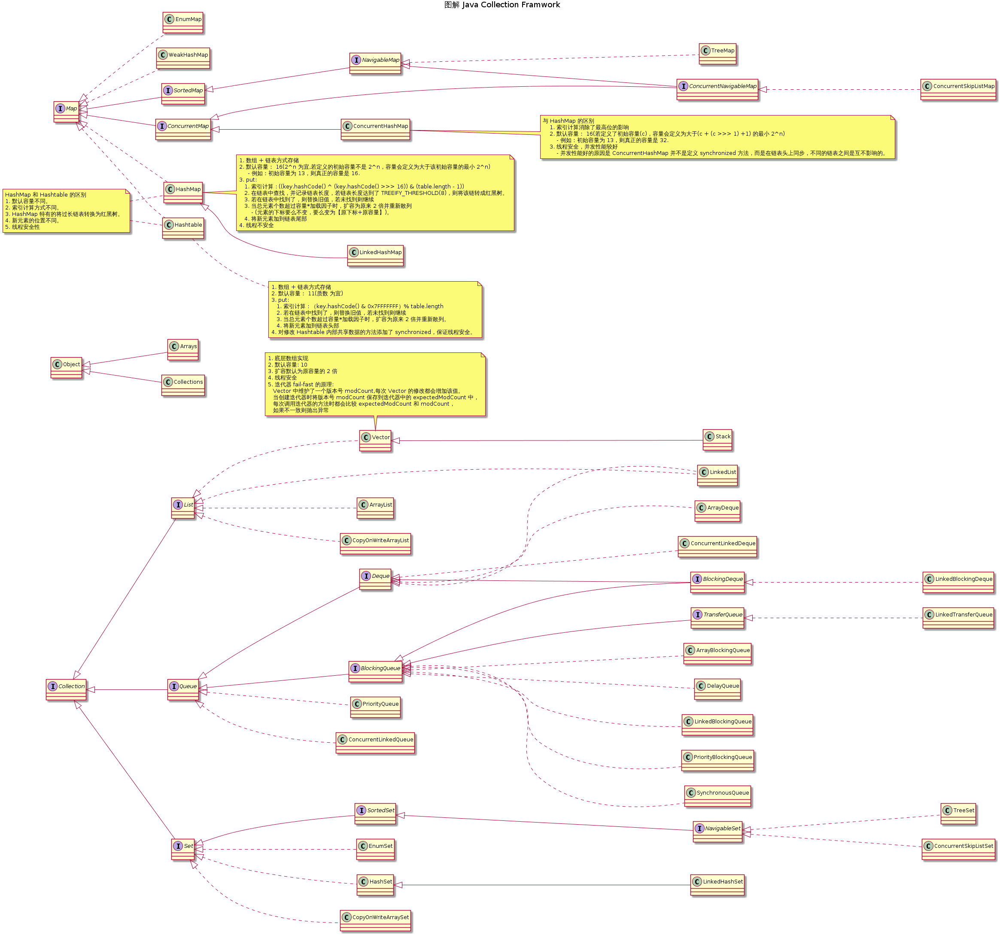

# 图解 Java Collection Framework

一直想全面的学习一下 Java 的集合框架，现在总算是着手开始做了。

本文介绍的集合框架实现类涵盖了 `java.util` 和 `java.util.concurrent` 两个包。可能会有遗漏，后期会再进行补充。

目前的计划是将每个实现类的特点使用 `note` 的方式直接标注到图上。

注：
- 绘制图形使用的工具是 [PlantUML](http://plantuml.com/) + [Visual Studio Code](https://code.visualstudio.com/) + [PlantUML Extension](https://marketplace.visualstudio.com/items?itemName=jebbs.plantuml)
- 图形 `PlantUML` 源文件：[java-collection-framework.pu](../res/java-collection-framework.pu)

---

## 参考

1. [Collections Framework Overview](https://docs.oracle.com/javase/8/docs/technotes/guides/collections/overview.html)
1. [Java™ Platform, Standard Edition 8
API Specification](https://docs.oracle.com/javase/8/docs/api/)
1. [Source code](#)
