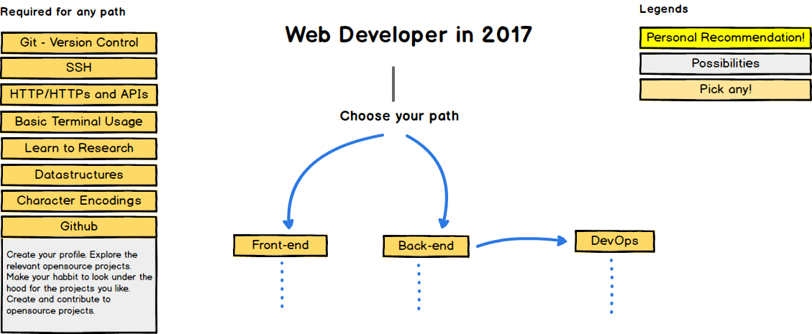
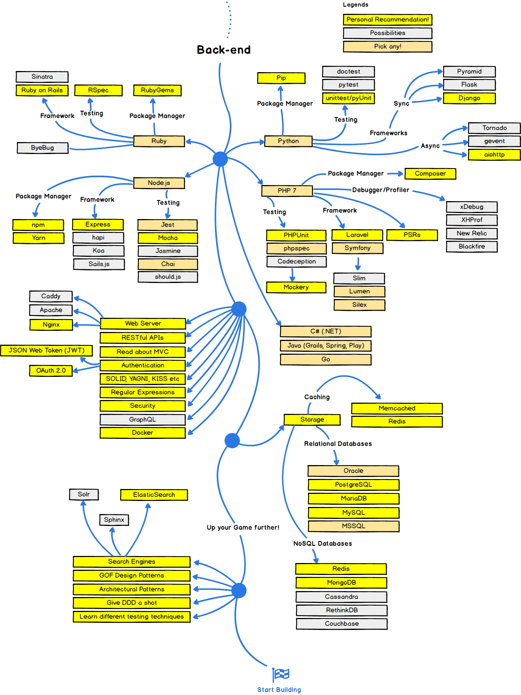
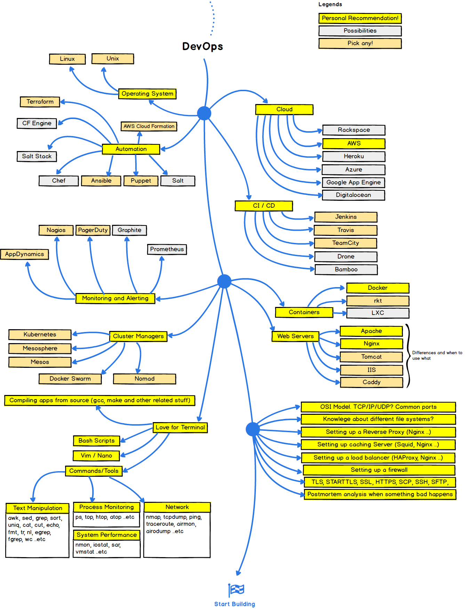
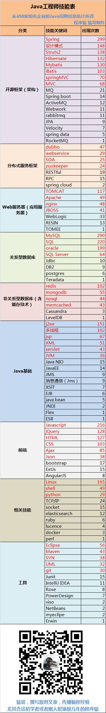

# 岗位要求总结及待学习技术汇总

<!-- TOC -->

- [岗位要求总结及待学习技术汇总](#岗位要求总结及待学习技术汇总)
    - [岗位要求](#岗位要求)
        - [（腾讯）软件开发 - 后台开发方向](#腾讯软件开发---后台开发方向)
        - [（阿里）研发工程师JAVA Software Engineer - Java](#阿里研发工程师java-software-engineer---java)
        - [（网易）高级Java开发工程师（云音乐）-音乐事业部002](#网易高级java开发工程师云音乐-音乐事业部002)
        - [（携程）开发工程师](#携程开发工程师)
        - [（美团点评）【实习生】后台开发工程师](#美团点评实习生后台开发工程师)
        - [（今日头条）后台研发工程师](#今日头条后台研发工程师)
        - [总结](#总结)
    - [web developer roadmap](#web-developer-roadmap)
    - [参考](#参考)

<!-- /TOC -->

---

## 岗位要求

### （腾讯）软件开发 - 后台开发方向

- 岗位描述

> 从事腾讯产品服务后台的架构设计、开发、优化及运营工作；使用最优秀的架构设计及算法实现，在网络接入、业务运行逻辑、用户数据存储、业务数据挖掘等方向，为海量互联网用户提供稳定、安全、高效和可靠的专业后台支撑体系。

- 岗位要求

> 编程基本功扎实，掌握C/C++/JAVA等开发语言、常用算法和数据结构；

> 熟悉TCP/UDP网络协议及相关编程、进程间通讯编程；

> 了解Python、Shell、Perl等脚本语言；
了解MYSQL及SQL语言、编程，了解NoSQL, key-value存储原理；

> 全面、扎实的软件知识结构，掌握操作系统、软件工程、设计模式、数据结构、数据库系统、网络安全等专业知识；

> 了解分布式系统设计与开发、负载均衡技术，系统容灾设计，高可用系统等知识。

### （阿里）研发工程师JAVA Software Engineer - Java

- 岗位描述
> 如果你对基础技术感兴趣，你可以参与基础软件的设计、开发和维护，如分布式文件系统、缓存系统、Key/Value存储系统、数据库、Linux操作系统和Java优化等；

> 如果你热衷于高性能分布式技术，你可以参与高性能分布式服务端程序的系统设计，为阿里巴巴的产品提供强有力的后台支持，在海量的网络访问和数据处理中，设计并设施最强大的解决方案；

- 岗位要求

> 或许，你熟悉Unix/Linux/Win32环境下编程，并有相关开发经验，熟练使用调试工具，并熟悉Perl，Python，shell等脚本语言；

> 或许，你熟悉网络编程和多线程编程，对TCP/IP，HTTP等网络协议有很深的理解，并了解XML和HTML语言；

> 或许，你热衷于数据库技术，能够熟练编写SQL脚本，有MySql或Oracle应用开发经验；

> 也有可能，你在学校的时候作为骨干参与学生网站的建设和开发；

### （网易）高级Java开发工程师（云音乐）-音乐事业部002

- 岗位描述

> 负责互联网产品后端服务器架构设计，要求系统具有可扩展性， 能够支持大量并发用户；

> 根据产品需求完成服务器架构和模块设计、编码、测试以及文档编写等工作；

> 优化系统性能， 保证服务器质量和性能。

- 岗位要求

> 理解java运行时工作原理，熟悉jvm性能调优，能够充分利用java特性支持框架与程序库的设计开发;

> 熟悉多线程编程，熟练使用java并发包下的各项常用基础设施;

> 熟悉常用网络协议，如TCP/IP, HTTP; 熟悉网络编程，能够熟练使用java nio开发高并发、高吞吐量的服务;

> 能够熟练使用linux，能够利用常用的工具对程序进行跟踪诊断;

> 有分布式系统开发经验，对消息服务、负载均衡、高可用机制等有深入理解;

### （携程）开发工程师

- 岗位描述

> 分析、设计、开发和测试中国最大旅游电子商务网站的前台功能和后台框架；

> 对大规模、高并发的在线系统进行性能诊断、性能调优和代码优化

- 岗位要求

> 熟悉基本数据结构和基本算法实现，对代码优化感兴趣，理解代码背后的运行机制；

> 熟练使用至少一种开发语言（c、c++、C#、Java、python等）；

> 了解数据库编程的基本知识和常用SQL的开发和性能调优，了解SQLServer或MySql数据库更优；

> 了解多线程编程，大数据相关技术，对开源项目有浓厚兴趣；

> 优秀的分析问题和解决问题的能力，勇于解决难题；

> 期待你具备Linux开发经验或JavaWeb开发经验；

### （美团点评）【实习生】后台开发工程师

- 岗位描述

> 后端模块、数据平台、基础服务和云计算功能的开发工作；

> 需求定义，确定设计方案并负责最终实现。

- 岗位要求

> 至少学习并实践过一门以上的开发语言（比如：Java、C、C++、Python、Ruby等）；

> 读过Thinking in Java，Effective Java等Java名著；

> 熟悉基础数据结构，如链表，二叉树等；

> 对新技术有强烈的求知精神，能深入代码研究，能通过英文论文等第一手资料了解业界新技术；

### （今日头条）后台研发工程师

- 岗位描述

> 负责架构设计和开发，为亿级用户提供优质顺畅的信息服务和极致体验；

> 参与设计系统技术方案，核心代码开发和系统调优；

> 参与制定代码规范、测试规范，建立起开发质量控制方法；

> 协助团队攻克各种高并发、数据隔离、系统解耦等方面的技术难关；

- 岗位要求

> 热爱计算机科学和互联网技术，精通至少一门编程语言，包括但不仅限于：Java，C/C++，PHP， Python，Go；

> 掌握扎实的计算机基础知识，深入理解数据结构、算法和操作系统知识；

> 有优秀的逻辑分析能力，能够对业务逻辑进行合理的抽象和拆分；

### 总结

1. 熟练掌握一门语言 （Java + JVM(GC)）
1. 网络协议（TCP/UDP），网络编程。
1. 多线程，java 并发包
1. 数据库，MySQL，SQL 优化
1. 操作系统，熟练使用 Linux；熟练使用调试工具，并熟悉Perl，Python，shell等脚本语言；
1. 分布式系统设计与开发、负载均衡技术，系统容灾设计，高可用系统

## web developer roadmap
- 
- 
- 
- 

## 参考

1. [（腾讯）软件开发 - 后台开发方向](http://join.qq.com/post.php?zwl=75)
1. [（阿里）研发工程师JAVA Software Engineer - Java](https://campus.alibaba.com/traineePositions.htm?refno=11757)
1. [（网易）高级Java开发工程师（云音乐）-音乐事业部002](http://hr.163.com/position/detail.do?id=4955)
1. [（携程）开发工程师](http://techshow.ctrip.com/campus/campus-sfe.php?job_type=job_1)
1. [（美团点评）【实习生】后台开发工程师](http://campus.meituan.com/#/jobDetail/8373/)
1. [（今日头条）后台研发工程师](https://job.toutiao.com/job/detail/5792)
1. [Roadmap to becoming a web developer in 2017](https://github.com/kamranahmedse/developer-roadmap)
1. [Java工程师技能表](http://mp.weixin.qq.com/s?__biz=MjM5NzA1MTcyMA==&mid=2651163038&idx=1&sn=28d919cea7c915f093d4333858037df2&chksm=bd2ec5b98a594cafd6c203db80f444c168e64dc5757dbd179ad2ca3062618c4d38a6fbd6142e&mpshare=1&scene=22&srcid=0323pMGmrZreC5DehdEfUAsO#rd)
