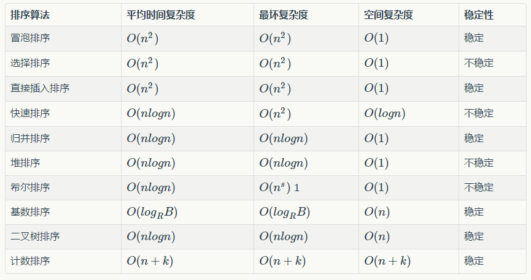

# 常见排序算法实现(Java)



```java
package com.github.crainstorm.sort;


import java.util.Arrays;
import java.util.Random;

/**
 * Created by chen on 4/14/17.
 */
public class Sort {
    private static final int SIZE = 50;
    private static int[] array = new int[SIZE];

    public static void init() {
        Random random = new Random();
        for (int i = 0; i < SIZE; ++i) {
            array[i] = random.nextInt(100);
        }
    }

    private static void swap(int index1, int index2) {
        int temp = array[index1];
        array[index1] = array[index2];
        array[index2] = temp;
    }

    /**
     * 冒泡排序
     * <p>
     * 下标小于 i 的元素都是已排好序的，内层 for 循环使小元素一步一步交换到前面
     * <p>
     * <p>
     * 时间复杂度：O(n^2)
     * 空间复杂度：O(1)
     *
     * @param array
     */
    public static void bubbleSort(int[] array) {
        if (array == null) {
            throw new IllegalArgumentException("array can't be null");
        }
        int len = array.length;
        for (int i = 0; i < len; ++i) {
            for (int j = len - 1; j > i; --j) {
                if (array[j - 1] > array[j]) {
                   swap(j-1,j);
                }
            }
        }
    }

    /**
     * 选择排序
     * <p>
     * 下标小于 i 的元素都是已排好序的，
     * 内层 for 循环寻找 [i,len) 之间最小的元素，
     * 然后将其与 下标为 i 的元素交换位置
     * <p>
     * 时间复杂度：O(n^2)
     * 空间复杂度：O(1)
     *
     * @param array
     */
    public static void selectSort(int[] array) {
        if (array == null) {
            throw new IllegalArgumentException("array can't be null");
        }
        int len = array.length;
        for (int i = 0; i < len; ++i) {
            int index = i;
            for (int j = i + 1; j < len; ++j) {
                if (array[index] > array[j]) {
                    index = j;
                }
            }
            if (index != i) {
                swap(index, i);
            }
        }
    }

    /**
     * 插入排序
     * <p>
     * 下标小于 i 的元素都是已排好序的，
     * 内层 while 循环寻找元素 i 适合插入的位置，并将大于 array[i] 的元素后移
     * <p>
     * 时间复杂度：O(n^2)
     * 空间复杂度：O(1)
     *
     * @param array
     */
    public static void insertSort(int[] array) {
        if (array == null) {
            throw new IllegalArgumentException("array can't be null");
        }
        int len = array.length;
        for (int i = 1; i < len; ++i) {
            int j = i - 1;
            int temp = array[i];
            while (j > -1 && temp < array[j]) {
                array[j + 1] = array[j];
                --j;
            }
            array[j + 1] = temp;
        }
    }

    /**
     *
     * 快排
     *
     * 选取最左侧的元素作为枢轴
     *
     * 时间复杂度：O(nlogn)
     * 空间复杂度：O(logn)
     *
     * @param array
     */
    public static void quickSort(int[] array) {
        if (array == null) {
            throw new IllegalArgumentException("array can't be null");
        }

        quickSort(array, 0, array.length - 1);
    }

    private static void quickSort(int[] array, int left, int right) {
        if (left < right) {
            int mid = partition(array, left, right);
            quickSort(array, left, mid - 1);
            quickSort(array, mid + 1, right);
        }
    }

    /**
     * 进行分区，返回枢轴所在下标。枢轴的左侧元素均比枢轴小，右侧元素均比枢轴大。
     *
     * @param array
     * @param left
     * @param right
     * @return
     */
    private static int partition(int[] array, int left, int right) {
        int leftIndex = left;    // 左游标
        int rightIndex = right;  // 右游标
        int pivot;               // 枢轴下标

        int midVal = array[leftIndex];
        leftIndex++;
        while (true) {
            while (leftIndex < rightIndex && midVal >= array[leftIndex]) {
                ++leftIndex;
            }
            while (leftIndex < rightIndex && midVal <= array[rightIndex]) {
                --rightIndex;
            }

            if (leftIndex < rightIndex) {
                swap(leftIndex, rightIndex);
            } else {
                if (midVal > array[leftIndex]) {
                    swap(left, leftIndex);
                    pivot = leftIndex;
                } else {
                    swap(left, leftIndex - 1);
                    pivot = leftIndex - 1;
                }
                break;
            }
        }
        return pivot;
    }


    /**
     * 归并排序
     * <p>
     * 使用递归的方式实现，比较简洁，已理解。
     * <p>
     * 时间复杂度：O(nlogn)
     * 空间复杂度：O(n)
     *
     * @param array
     */
    public static void mergeSort(int[] array) {
        if (array == null) {
            throw new IllegalArgumentException("array can't be null");
        }
        int[] temp = new int[SIZE];
        mergeSort(array, temp, 0, array.length - 1);
    }

    private static void mergeSort(int[] array, int[] temp, int begin, int end) {
        if (begin < end) {
            int mid = (begin + end) / 2;
//            System.out.print("begin: " + begin + " end: " + end);
//            System.out.println("     [" + begin +", " + mid + "], [" + (mid+1) +"," + end + "]");
            mergeSort(array, temp, begin, mid);
            mergeSort(array, temp, mid + 1, end);
            merge(array, temp, begin, mid, end);
        }
    }

    /**
     *
     * 合并两个已排好序的数列，两个数列所在范围是 [begin, mid], [mid+1, end]
     *
     * @param array
     * @param temp
     * @param begin
     * @param mid
     * @param end
     */
    private static void merge(int[] array, int[] temp, int begin, int mid, int end) {
        int i = begin;
        int j = mid + 1;
        int k = begin;
        while (i <= mid && j <= end) {
            if (array[i] <= array[j]) {
                temp[k++] = array[i++];
            } else {
                temp[k++] = array[j++];
            }
        }
        while (j <= end) {
            temp[k++] = array[j++];
        }
        while (i <= mid) {
            temp[k++] = array[i++];
        }
        for (i = begin; i <= end; ++i) {
            array[i] = temp[i];
        }
//        System.out.println(Arrays.toString(array));
    }

    /**
     * 堆排序
     * <p>
     * 基本思路：
     * 1. 构造最大堆
     * 2. 将 array[0] 与 array[length-1] 交换，并将新的 array[0] 下沉恢复 [0,length-1) 的最大堆...一直到 恢复 [0,1) 的最大堆
     *
     * @param array
     */
    public static void heapSort(int[] array) {
        if (array == null) {
            throw new IllegalArgumentException("array can't be null");
        }
        // 构造最大堆
        // [array.length/2 , array.length-1] 的元素都是叶子节点，不需要下沉
        for (int i = array.length / 2 - 1, end = array.length - 1; i >= 0; --i) {
            down(array, i, end);
        }

        // 堆排序
        for (int end = array.length - 1; end > 0; ) {
            swap(0, end--);
            down(array, 0, end);
        }
    }

    /**
     *
     * 将数组中下标为 root 的元素进行下沉，终结下标为 end(包含 end)
     *
     * @param array
     * @param root
     * @param end
     */
    private static void down(int[] array, int root, int end) {
        int leaf = 2 * root + 1;
        while (leaf <= end) {
            if (leaf + 1 <= end && array[leaf] < array[leaf + 1]) {
                leaf++;
            }
            if (array[root] > array[leaf]) {
                break;
            }
            swap(root, leaf);
            root = leaf;
            leaf = 2 * root + 1;
        }
    }


    public static void main(String[] args) {
//        System.out.println(-1 / 2);
        init();
        System.out.println(Arrays.toString(array));
//        bubbleSort(array);
//        selectSort(array);
//        insertSort(array);
        quickSort(array);
//        mergeSort(array);
//        heapSort(array);
        System.out.println(Arrays.toString(array));
    }
}

```

## 参考

1. [各种排序算法总结](http://www.jianshu.com/p/f5baf7f27a7e)
