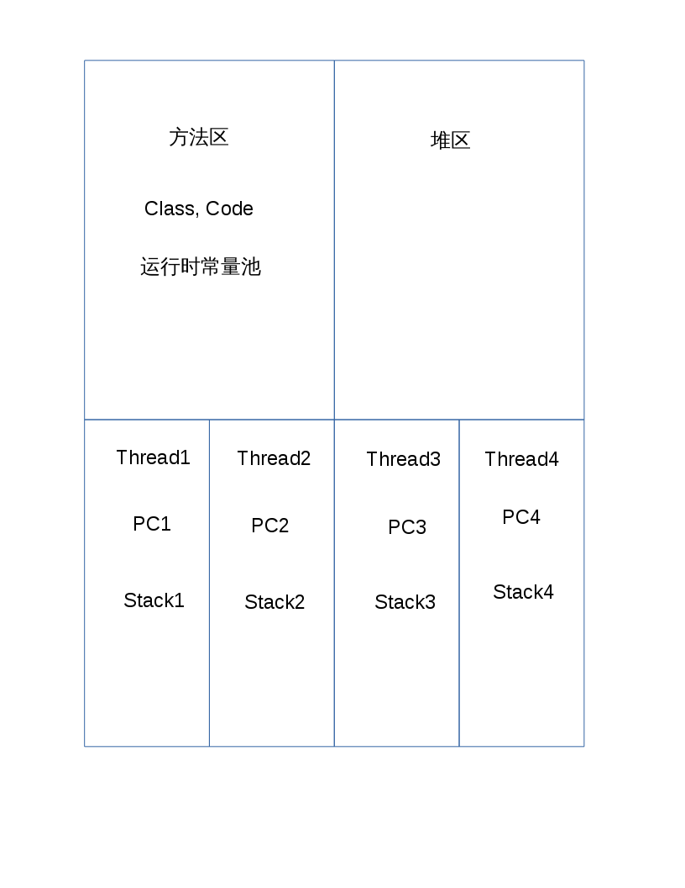
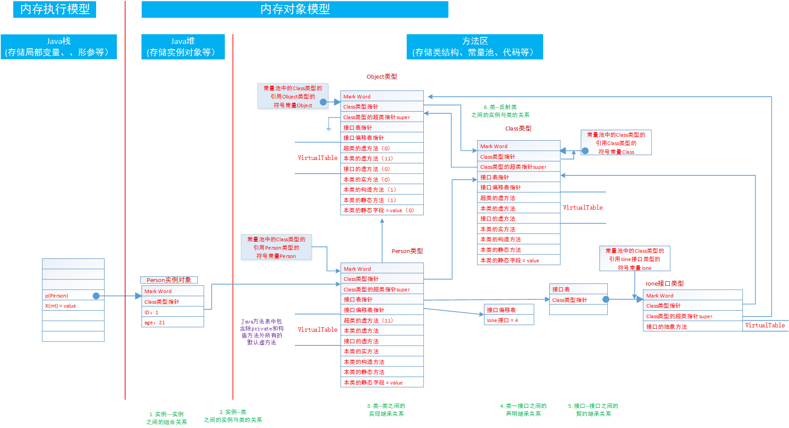
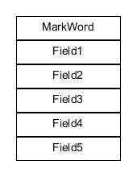
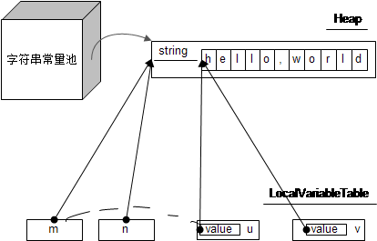

# 深入理解 Java 虚拟机 学习笔记

<!-- TOC -->

- [深入理解 Java 虚拟机 学习笔记](#深入理解-java-虚拟机-学习笔记)
    - [第二章 Java 内存区域与内存溢出异常](#第二章-java-内存区域与内存溢出异常)
        - [内存区域](#内存区域)
            - [对象创建](#对象创建)
            - [对象的内存布局](#对象的内存布局)
            - [对象访问](#对象访问)
        - [内存溢出异常](#内存溢出异常)
            - [常用 JVM 参数 （Java HotSpot VM）](#常用-jvm-参数-java-hotspot-vm)
            - [常见异常及可能原因](#常见异常及可能原因)
            - [String 与字符串常量](#string-与字符串常量)
    - [第三章 垃圾收集器与内存分配策略](#第三章-垃圾收集器与内存分配策略)
        - [判断对象是否存活](#判断对象是否存活)
        - [垃圾收集算法](#垃圾收集算法)
        - [HotSpot 算法实现](#hotspot-算法实现)
        - [垃圾收集器](#垃圾收集器)
        - [内存分配与回收策略](#内存分配与回收策略)
    - [参考](#参考)

<!-- /TOC -->

---

## 第二章 Java 内存区域与内存溢出异常

### 内存区域




-- from 姜志明
#### 对象创建

1. 加载类
    - 若已经在内存中则跳过。
    - **类加载完以后就可以确定对象所需的空间大小** // TODO why?
1. 分配内存
    - 根据 GC 回收算法的不同，分配方式略有区别。
        - 标记整理算法，使用空闲列表
        - 带压缩的算法，使用指针碰撞（已分配和未分配内存间由指针分隔）
1. 内存清零
1. 对象初始化

#### 对象的内存布局



- MarkWord 占用一个 **字** 的大小，其中分为两部分：
    1. 对象自身运行时元数据。例如，哈希码、GC 分代年龄、锁状态标志等等
    1. 类型指针。指向其类的元数据。
    1. 若对象是数组则还需要保存数组的长度。
- 域的存储顺序：
    1. 基本类型优先，长度长的优先。
    1. 父类域优先。子类较短域可插入父类域空隙。
    1. 受虚拟机分配策略参数和域定义顺序的影响。

#### 对象访问

两种方式：

1. 直接引用
1. 引用句柄（句柄池）

### 内存溢出异常

#### 常用 JVM 参数 （Java HotSpot VM）

|参数|含义|实例|
|:---|:---|:---|
|-verbose:class|显示每一个被加载的类的信息||
|-verbose:gc|显示每一个 GC 事件的信息||
|-Xmnsize|年轻代最大容量|-Xmn256m|
|-Xmssize|堆的初始大小。1024 的整数倍并且要大于 1MB|-Xms6m|
|-Xmxsize|堆的最大容量。1024 的整数倍并且要大于 2MB|-Xmx80m|
|-Xsssize|线程栈容量。平台不同默认值不同，详情参考文档。Linux/x64 (64-bit): 1024 KB|-Xss1m|
|-XX:MaxDirectMemorySize=size|直接内存的最大容量，默认与堆容量相同|-XX:MaxDirectMemorySize=1m|
|-XX:+HeapDumpOnOutOfMemory|当抛出 OOM 时，使用 HPROF 将堆的快照保存到当前目录||
|-XX:HeapDumpPath=path|设置快照输出路径|-XX:HeapDumpPath=/var/log/java/java_heapdump.hprof|
|-XX:+PrintGCDetails|开启在 GC 时打印详细信息||
|-XX:SurvivorRatio=ratio|新生代中 eden 与 survivor 的大小比例，默认为 8|-XX:SurvivorRatio=4|

参考： [Java HotSpot VM 参数](http://docs.oracle.com/javase/8/docs/technotes/tools/unix/java.html)

#### 常见异常及可能原因

- 堆区
    - `OutOfMemoryException`。使用工具对快照进行分析，看是否发生了内存泄露（内存中有不再使用的但无法回收的对象或资源）。若是，则通过分析引用链找到根源，解决问题；若不是检查虚拟机堆参数，看是否能够调大。再检查代码中是否有生命周期很长的大对象。
- 虚拟机栈和本地方法栈
    - `OutOfMemoryException`。栈容量 * 线程数量 = 固定值。当线程数量过多时会引发，可以适当减小栈容量。
    - `StackOverflowException`。按异常查根源。
- 方法区和运行时常量池
- 直接内存溢出
    - 不正确的使用 NIO。 
    
#### String 与字符串常量

```java
public class StringTest {
	public static void main(String[] args) {
		String m = "hello";
		String n = "hello";
		String u = new String(m);
		String v = new String("hello");
		
		System.out.println("m == n: " + (m == n));
		System.out.println("m == u: " + (m == u));
		System.out.println("m == v: " + (m == v));
		System.out.println("u == v: " + (u == v));
	}
}

output:
m == n: true
m == u: false
m == v: false
u == v: false
```



参考： [初探Java字符串](http://mccxj.github.io/blog/20130615_java-string-constant-pool.html)

## 第三章 垃圾收集器与内存分配策略

### 判断对象是否存活

1. 引用计数器算法。给对象添加一个引用计数器，增加/删除引用时对计数器进行修订。但是该方法因为无法解决循环引用（例如两个对象互相引用）的问题，所以一般不使用该方法
1. 可达性分析算法。从 `GC root` 开始递归查询并标记，结束后未被标记的（不可达的）即为可回收的对象。`GC root` 共有四种：
    - 栈中引用的对象
    - 方法区常量引用的对象
    - 方法区静态域引用的对象
    - 本地方法中 JNI 引用的对象（不太懂）
1. 回收方法区
    - 新生代的回收效率可达到 70% - 95%，而永久代则低的多（性价比太低）
    - 在大量使用反射、动态代理、CGLib 等 ByteCode 框架、动态生成 JSP 以及 OSGi 这类频繁自定义 ClassLoader 的场景都需要虚拟机有卸载类的能力。 

### 垃圾收集算法

1. 标记-清除算法
    - 扫描一遍，标记出需要回收的对象，再扫描将其清除
    - 标记/清除两阶段时间效率都不高，且回收后空间较零碎。
1. 复制算法
    - 将内存分为两块，当一块中内存不足时，将其中所有存活对象复制到另一块中，回收当前一整块。
    - 目前商用虚拟机大都使用这一算法回收新生代。将内存划分为一个较大的 Eden 区和两块较小的 Survivor. Eden：Survivor = 8：1
1. 标记整理算法
    - 标记出须清理的对象，然后其余对象移动到一端
1. 分代收集算法
    - 新生代使用复制算法
    - 永久代使用其他两种算法

### HotSpot 算法实现

1. 当程序执行到安全点（safepoint）时进行 GC，通过在安全点（safepoint）生成的 OopMaps 快速遍历 GC root 进行回收。
    - 安全点（safepoint）：指令序列复用的位置。例如方法调用、循环结构、异常跳转等位置。
    - OopMaps：一种特殊的数据结构，用于枚举 GC root
1. 但是如果线程处于不执行的状态时，如 sleep 或 blocked 无法执行到安全点，即需要提前标记为安全区域(safe region)。GC 时不考虑处于安全区域的线程，若安全区域代码执行结束但 GC 未结束时该线程等待 GC 结束信号。
    - 安全区域（safe region）：引用不发生改变的代码片段

### 垃圾收集器


- 并发(concurrent) vs 并行(parallel)
    1. 并行是同时进行（多 CPU）
    1. 并发可交替
- Minor GC vs Major GC vs Full GC
    - Minor GC：只回收新生代
    - Major GC：只回收永久代
    - Full GC： 回收整个堆。相当于 Minor GC + Major GC
1. serial。单线程，简单高效。复制算法
1. PerNew。serial 的多线程版本，并行。
1. parallel Scavenge。 与 PerNew 类似，复制算法、多线程、并行。但侧重吞吐量，拥有自适应调节的能力。适合用在后台不需要太多用户交互的地方。
    - 吞吐量 = 用户代码执行时间 / （用户代码执行时间 + 垃圾回收时间）
    - 自适应调节：虚拟机根据但前系统的运行情况，自动调节虚拟机各参数以确保最大吞吐量。
1. serial old。serial 的永久代版本。采用标记整理算法。
1. parallel old。parallel Scavenge 的老年代版本，采用标记整理算法。与 parallel scavenge 搭配可以用在注重吞吐量及 CPU 资源敏感的地方。
1. CMS（concurrent mark sweep）。并发低停顿，使用标记清理算法。非常优秀的一款收集器，但还是有几个缺点：
    1. 对 CPU 资源敏感，当其小于数量小于 4 个是可能会对用户程序有较大影响。默认启动回收线程数 = （CPU 数 + 3）/ 4
    1. 无法处理浮动垃圾。浮动垃圾：在垃圾回收期间生成的垃圾
    1. 回收后会留有大量的空间碎片。
1. G1 //TODO

### 内存分配与回收策略

TLAB（Thread local allocate buffer）线程私有分配缓冲区，每个线程一个

1. 对象优先在 Eden 区分配。内存不足时触发 Minor GC。
1. 大对象直接进入老年代。例如数组或超过参数指定大小的对象。
1. 长期存活的对象进入老年代。GC 超过一定次数仍存活的对象。默认为 15 次，可通过虚拟机参数 `-XX:MaxTenuringThreshold` 来设置。
1. 动态对象年龄判定。当一个年龄的所有对象大小总和超过 Servivor 空间一半时，大于等于该年龄的所有对象都进入老年代
1. 空间分配担保。当发生 Minor GC 时，若存活的对象过多，servivor 空间无法全部容纳时，会将剩余的对象直接放入永久代；若永久代空间不足以容纳时会引发一次 Full GC

## 参考

1. 郑州大学姜志明老师课件
1. [初探Java字符串](http://mccxj.github.io/blog/20130615_java-string-constant-pool.html) (非常好的一篇文章)
1. [Java HotSpot VM 参数](http://docs.oracle.com/javase/8/docs/technotes/tools/unix/java.html)
1. [Java HotSpot Virtual Machine Garbage Collection Tuning Guide](http://docs.oracle.com/javase/8/docs/technotes/guides/vm/gctuning/index.html)
1. [JVM 垃圾回收器工作原理及使用实例介绍 -- IBM](https://www.ibm.com/developerworks/cn/java/j-lo-JVMGarbageCollection/)
1. [Minor GC vs Major GC vs Full GC](https://plumbr.eu/blog/garbage-collection/minor-gc-vs-major-gc-vs-full-gc)