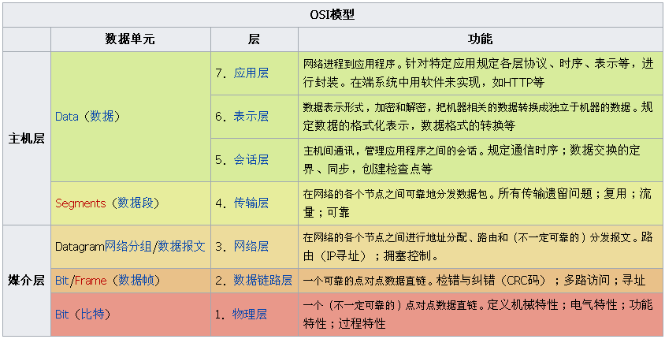
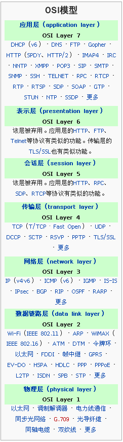

# 网络协议简要总结

将常见的网络协议依据 OSI 进行分层，并做简要描述。

<!-- TOC -->

- [概览](#概览)
- [应用层](#应用层)
    - [HTTP](#http)
    - [SMTP](#smtp)
    - [POP](#pop)
    - [IMAP](#imap)
    - [FTP](#ftp)
    - [DNS](#dns)
    - [DHCP](#dhcp)
    - [TELNET](#telnet)
    - [SSH](#ssh)
    - [SNMP](#snmp)
    - [RPC](#rpc)
- [表达层](#表达层)
- [会话层](#会话层)
- [传输层](#传输层)
    - [TCP](#tcp)
    - [UDP](#udp)
- [网络层](#网络层)
    - [IP](#ip)
    - [ICMP](#icmp)
    - [IGMP](#igmp)
    - [IPsec](#ipsec)
    - [BGP](#bgp)
    - [RIP](#rip)
    - [OSPF](#ospf)
    - [RAPR](#rapr)
- [数据链路层](#数据链路层)
    - [Wi-Fi](#wi-fi)
    - [ARP](#arp)
    - [ATM](#atm)
    - [DTM](#dtm)
    - [令牌环](#令牌环)
    - [以太网](#以太网)
    - [帧中继](#帧中继)
    - [PPP](#ppp)
- [物理层](#物理层)
- [参考](#参考)

<!-- /TOC -->

---

## 概览

## 应用层

### HTTP
### SMTP
### POP
### IMAP
### FTP
### DNS
### DHCP
### TELNET
### SSH
### SNMP
### RPC

## 表达层

## 会话层

## 传输层

### TCP
### UDP

## 网络层

### IP
### ICMP
### IGMP
### IPsec
### BGP
### RIP
### OSPF
### RAPR

## 数据链路层

### Wi-Fi
### ARP
### ATM
### DTM
### 令牌环
### 以太网
### 帧中继
### PPP

## 物理层

## 参考

1. [OSI模型](https://zh.wikipedia.org/wiki/OSI%E6%A8%A1%E5%9E%8B)
