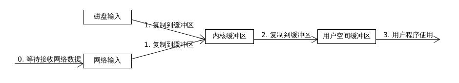

# 谈谈 Java 的 IO 机制[Paused]

通过对 Reference 中的博客的浏览阅读，对 NIO 已经有了基本的了解，可以继续阅读 Tomcat 源码了。IO 是一个很大的主题，在看的时候遇到了很多坑，不是一时半会能解决完的，所以先暂停，目前以 Tomcat 源码阅读为重点。

最近在看 Tomcat 架构，本篇谈 Java IO 机制，作为分析 Tomcat 请求处理流程的预备知识。

- 有关 Tomcat 架构及启动过程可以参考我之前写的一篇文章：谈谈 Tomcat 架构及启动过程[含部署]
- Tips: 与本篇文章在 Github 同一目录下。

<!-- TOC -->

- [Overview](#overview)
- [Five Unix IO model](#five-unix-io-model)
- [Block IO in Java](#block-io-in-java)
- [NonBlock IO in Java](#nonblock-io-in-java)
- [Asynchronous IO in Java](#asynchronous-io-in-java)
- [At Last](#at-last)
- [Reference](#reference)

<!-- /TOC -->

---

## Overview

## Five Unix IO model

《Unix 网络编程 - 卷一》 对这部分的描述非常经典，特别是书中描述 5 种 IO 模型的图形，一看就懂。推荐直接看这本书的 `6.2 IO 模型` 一节。这里我只简单的总结一下。

以输入为例，会经过两次数据复制，只有当数据到达用户空间缓冲区时对用户程序才是可用的。

整个复制过程如下图：

1. 阻塞 IO。会将当前程序挂起，直到数据到达用户空间缓冲区。
1. 非阻塞 IO。提交输入请求后，非阻塞 IO 会在图中 0-1 过程轮询内核，查看数据是否已就绪【这种方式会占用大量 CPU 时间】，若数据成功写入内核，则挂起当前程序，并执行 2 过程。
1. IO 复用。
1. 信号驱动 IO。先注册一个信号处理程序，启动 IO，执行 0-1 过程，当数据成功到达内核缓冲区时，内核发送一个信号，开始执行信号处理程序，挂起当前程序，并执行 2 过程。与非阻塞 IO 相比，执行 0-1 过程时不需要轮询。
1. 异步 IO。

## Block IO in Java

## NonBlock IO in Java

## Asynchronous IO in Java

## At Last

博客在 CentOS 7 下编辑，这个平台的中文输入法没有搜狗用的爽，文中出现的错别字的概率可能会大一点，如果影响到了理解内容，请给我提 Issue，我会尽快修订～

博客持续更新，欢迎 `Star` & `watch`。

**PS： 马上大四了，正在准备校招，如果各位大佬觉得博客写的还行的话，请砸面试机会给我。谢谢～**

- 邮箱： rainstorm.me@outlook.com
- 简历： https://github.com/c-rainstorm/Resume

## Reference

1. [《Unix 网络编程 - 卷一》](http://product.dangdang.com/23734637.html)
1. [Java I/O, NIO, and NIO.2](https://docs.oracle.com/javase/8/docs/technotes/guides/io/index.html)
1. [The Java™ Tutorials - Lesson: Basic I/O](http://docs.oracle.com/javase/tutorial/essential/io/index.html)
1. [Java™ Platform, Standard Edition 8
API Specification](https://docs.oracle.com/javase/8/docs/api/)
1. [深入分析 Java I/O 的工作机制](https://www.ibm.com/developerworks/cn/java/j-lo-javaio/index.html)
1. [Java I/O 模型的演进](http://www.importnew.com/21383.html)
1. [NIO 入门](https://www.ibm.com/developerworks/cn/education/java/j-nio/j-nio.html)
1. [Java IO 模型简述](http://haoran-10.iteye.com/blog/2311266)
1. [Java IO Tutorial](http://tutorials.jenkov.com/java-io/index.html)
1. [Java NIO Tutorial](http://tutorials.jenkov.com/java-nio/index.html)
