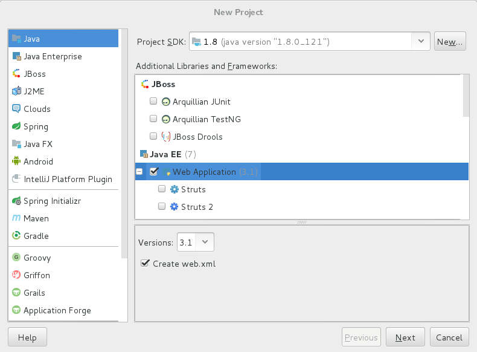
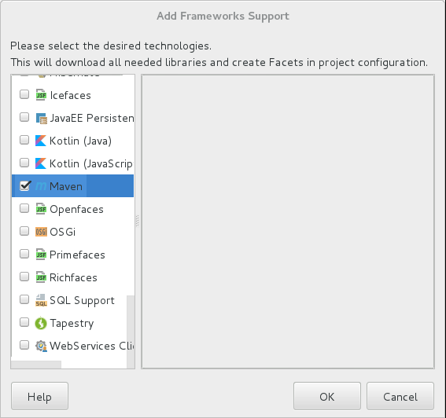

# Maven + Spring + SpringMVC + Mybatis 整合

通过这篇文章你可以获取的内容：
1. 整个配置流程。
1. 对于每一个配置项，Spring 到底帮我们做了什么？

本文假设读者：

1. 未使用 IDEA 进行过 Web 项目开发
1. 未使用过 Maven 进行项目构建
1. 已学习过 Spring、SpringMVC、Mybatis

环境搭建：

- IDE： `IntelliJ IDEA 2017.1.1（Ultimate)`
- Web Server: `Tomcat 8.0.43`
- Spring: `4.3.7.RELEASE`
- Mybatis: `3.4.4`

如果需要示例代码，可以参考 [SSM-Demo](https://github.com/c-rainstorm/ssm-Demo).

---

<!-- TOC -->

- [Maven + Spring + SpringMVC + Mybatis 整合](#maven--spring--springmvc--mybatis-整合)
    - [Spring && SpringMVC](#spring--springmvc)
        - [工程搭建](#工程搭建)
            - [新建 Web Application](#新建-web-application)
            - [添加 Maven 支持](#添加-maven-支持)
            - [工程目录简介](#工程目录简介)
        - [代码实现](#代码实现)
            - [View 层](#view-层)
            - [Controller](#controller)
                - [Service](#service)
        - [配置文件编写](#配置文件编写)
        - [运行测试](#运行测试)
    - [Spring && SpringMVC && Mybatis](#spring--springmvc--mybatis)
        - [代码实现](#代码实现-1)
        - [配置文件编写](#配置文件编写-1)
        - [运行测试](#运行测试-1)
    - [参考](#参考)

<!-- /TOC -->

---

## Spring && SpringMVC

### 工程搭建

#### 新建 Web Application

1. File -> new -> project..
1. Java -> Web Application
    - 

#### 添加 Maven 支持

1. 右键工程名，点击 Add Framwork Support..
    - 
1. 配置编译器源版本及目标字节码版本
    - 在 `pom.xml` 配置文件中添加以下配置。
    - **Tips：不添加的话目标字节码版本默认使用 `JDK1.5`**
    ```xml
    <properties>
        <maven.compiler.source>1.8</maven.compiler.source>
        <maven.compiler.target>1.8</maven.compiler.target>
    </properties>
    ```

#### 工程目录简介

```
.
|-- pom.xml                    // Maven 配置文件
|-- src
|   |-- main
|   |   |-- java               // Java 代码存放位置
|   |   `-- resources          // 配置文件存放位置
|   `-- test
|       `-- java               // 测试类存放位置
`-- web                        // 存放 View 层用到的文件，会直接部署到服务器
    |-- index.jsp
    `-- WEB-INF
        `-- web.xml            // Web 应用程序的 Web 组件的配置和部署信息
```


### 代码实现

我们以一个最简单的用户登陆操作来说明配置的过程。

#### View 层

1. form 表单
    ```html
    <!-- 1. 对应控制层 URL 为 /user/checkLogin -->
    <!-- 2. input 标签中的 class 属性在 JS 中进行元素定位需要用到 -->
    <!-- 3. input 标签中的 name 属性在控制层中提取表单数据时需要用到，即必须与控制层中对应方法的参数名或参数实体类中的域的名称一致，否则获取不到数据 -->
    <form action="${pageContext.request.contextPath}/user/checkLogin" method="post">
        username: <input type="text" class="username" name="username" placeholder="username..."><br>
        password: <input type="password" class="password" name="password" placeholder="password..."><br>
        <input type="submit" value="submit">
    </form>
    ```
1. 使用 JS 在传输之前进行加密
    ```js
    $(document).ready(function () {
        // 以为网络传输时使用明文，所以直接将密码提交到后台的方式很不安全，所以在传输之前就进行加密。
        // 在这里加密方法用的是 MD5 。你也可以选择其他的加密方式，加密用的 JS 库应该很容易着，
        // 这里我用的是 [JavaScript-MD5](https://github.com/blueimp/JavaScript-MD5)。
        $("form").on("submit", function () {
            var pass = $(".password");
            pass.val(md5(pass.val()));
        })
    })
    ```

#### Controller

1. 因为 Controller 需要用到 Spring 的注解，所以需要先添加 Maven 依赖。
    ```xml
    <properties>
        <org.springframework.version>4.3.7.RELEASE</org.springframework.version>
    </properties>

    <dependency>

    <dependencies>
        <dependency>
            <groupId>org.springframework</groupId>
            <artifactId>spring-core</artifactId>
            <version>${org.springframework.version}</version>
        </dependency>
        <dependency>
            <groupId>org.springframework</groupId>
            <artifactId>spring-beans</artifactId>
            <version>${org.springframework.version}</version>
        </dependency>
        <dependency>
            <groupId>org.springframework</groupId>
            <artifactId>spring-orm</artifactId>
            <version>${org.springframework.version}</version>
        </dependency>
        <dependency>
            <groupId>org.springframework</groupId>
            <artifactId>spring-context</artifactId>
            <version>${org.springframework.version}</version>
        </dependency>
        <dependency>
            <groupId>org.springframework</groupId>
            <artifactId>spring-web</artifactId>
            <version>${org.springframework.version}</version>
        </dependency>
        <dependency>
            <groupId>org.springframework</groupId>
            <artifactId>spring-webmvc</artifactId>
            <version>${org.springframework.version}</version>
        </dependency>
        <dependency>
            <groupId>org.springframework</groupId>
            <artifactId>spring-aop</artifactId>
            <version>${org.springframework.version}</version>
        </dependency>
        <dependency>
            <groupId>org.apache.logging.log4j</groupId>
            <artifactId>log4j-api</artifactId>
            <version>2.8.2</version>
        </dependency>
        <dependency>
            <groupId>org.apache.logging.log4j</groupId>
            <artifactId>log4j-core</artifactId>
            <version>2.8.2</version>
    </dependencies>
    ```
1. Controller
    ```java
    package com.github.crainstorm.oss.user.action;

    @Controller
    @RequestMapping("/user")
    public class UserAction {

        private static Logger logger = LogManager.getLogger(UserAction.class);
        @Autowired
        private UserService service;

        @RequestMapping("/checkLogin")
        public String checkLogin(User user) {
            logger.trace("enter checkLogin...");
            if (logger.isDebugEnabled()) {
                logger.debug(user);
            }
            if (service.loginSuccess(user)) {
                logger.info("login success...");
                return "redirect:/index.jsp";
            } else {
                logger.info("login failed...");
                return "login/user";
            }
        }
    }
    ```
1. 用到了 `log4j2`, 简单配置一下

    ```xml
    <?xml version="1.0" encoding="UTF-8"?>

    <Configuration status="WARN">
        <Appenders>
            <Console name="Console" target="SYSTEM_OUT">
                <PatternLayout pattern="%d [%t] %-5level %logger{36} - %msg%n"/>
            </Console>
        </Appenders>
        <Loggers>
            <!-- 类寻找 Logger 时会根据包名一层一层向上找，如果没有找到，则默认使用 Root -->
            <Root level="trace">
                <AppenderRef ref="Console"/>
            </Root>
        </Loggers>
    </Configuration>
    ```

##### Service


```java
package com.github.crainstorm.oss.user.service;

public interface UserService {
    boolean loginSuccess(User user);
}
```

```java
package com.github.crainstorm.oss.user.service;

@Service
public class UserServiceImpl implements UserService {
    private static final Logger LOGGER = LogManager.getLogger(UserServiceImpl.class);

    // 因为先配置 Spring + SpringMVC， 所以 dao 层先不管
    public boolean loginSuccess(User user) {
        return true;
    }
}
```

### 配置文件编写
### 运行测试

## Spring && SpringMVC && Mybatis

### 代码实现
### 配置文件编写
### 运行测试

## 参考
