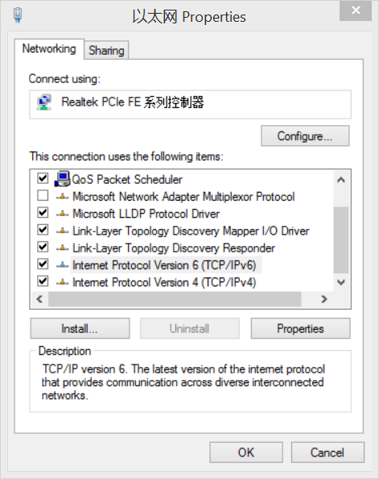
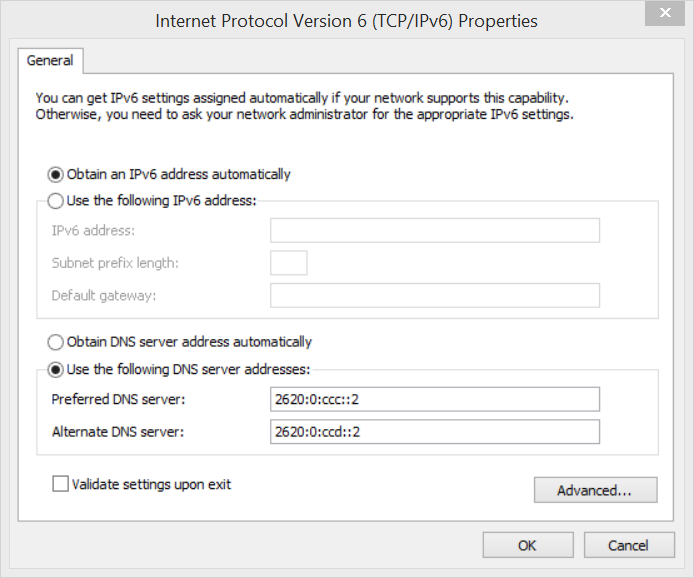
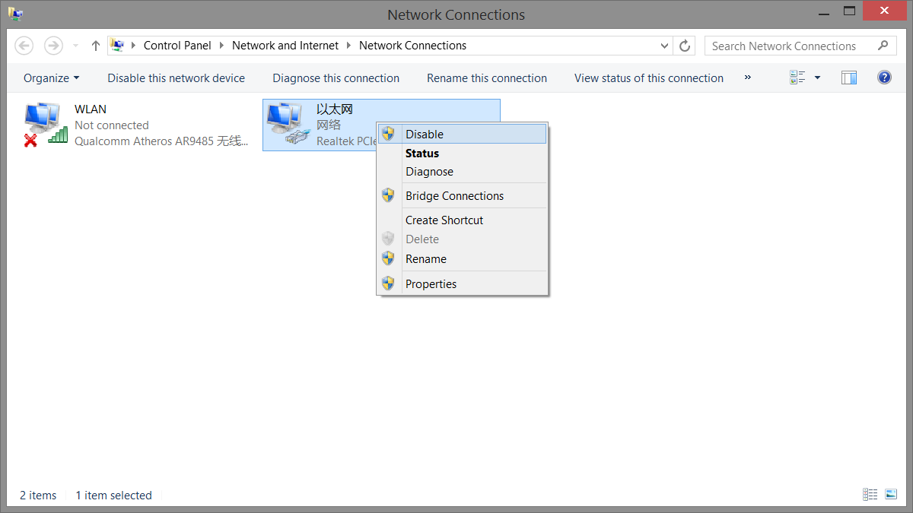

# 双平台启用 IPv6

目前操作系统（Linux / Windows）一般都支持 IPv6 协议栈，启用 IPv6 只需添加 nameserver 即可使用。

## Windows

- **添加完 nameserver 需要重启适配器（见第三张图）**

1. 
1. 
1. 
1. [测试你的 IPv6 配置](http://www.test-ipv6.com/)

## Linux

```bash
// Debian 8.7 测试有效
$ sudo echo "nameserver 2620:0:ccc::2" >> /etc/resolv.conf
```
- [测试你的 IPv6 配置](http://www.test-ipv6.com/)


## 参考

1. [IPv6 | OpenDNS](https://www.opendns.com/about/innovations/ipv6/)
1. [Configure your network settings to use Google Public DNS](https://developers.google.com/speed/public-dns/docs/using)